```python
import warnings
warnings.filterwarnings("ignore")

import numpy as np
import pandas as pd
import seaborn as sns
!pip install matplotlib
import matplotlib.pyplot as plt
```

    Requirement already satisfied: matplotlib in d:\program files\data science\anaconda\lib\site-packages (3.3.1)
    Requirement already satisfied: numpy>=1.15 in d:\program files\data science\anaconda\lib\site-packages (from matplotlib) (1.18.4)
    Requirement already satisfied: cycler>=0.10 in d:\program files\data science\anaconda\lib\site-packages (from matplotlib) (0.10.0)
    Requirement already satisfied: certifi>=2020.06.20 in d:\program files\data science\anaconda\lib\site-packages (from matplotlib) (2020.6.20)
    Requirement already satisfied: pillow>=6.2.0 in d:\program files\data science\anaconda\lib\site-packages (from matplotlib) (6.2.0)
    Requirement already satisfied: pyparsing!=2.0.4,!=2.1.2,!=2.1.6,>=2.0.3 in d:\program files\data science\anaconda\lib\site-packages (from matplotlib) (2.4.2)
    Requirement already satisfied: python-dateutil>=2.1 in d:\program files\data science\anaconda\lib\site-packages (from matplotlib) (2.8.0)
    Requirement already satisfied: kiwisolver>=1.0.1 in d:\program files\data science\anaconda\lib\site-packages (from matplotlib) (1.1.0)
    Requirement already satisfied: six in d:\program files\data science\anaconda\lib\site-packages (from cycler>=0.10->matplotlib) (1.12.0)
    Requirement already satisfied: setuptools in d:\program files\data science\anaconda\lib\site-packages (from kiwisolver>=1.0.1->matplotlib) (41.4.0)
    

## TOC:
### Table of Contents

* [Feature Engineering](#feature-engineering)
    * [1. Data Intuition](#data-intuition)
    * [2. Numeric Data](#numeric-data)
    * [3. Categorical Variables](#category)
    * [4. Testing for Normality](#normality)

     
* [Modeling](#chapter2)
    * [Linear Regression](#linear)
    * [Lasso Regression](#lasso)
    * [Ridge Regression](#ridge)
    * [ElasticNet Regression](#elastic)
    * [Random Forest Regression](#randomforest)
    * [XGBoost Regression](#xgboost)
    * [Stacking](#stacking)
    
    
    

https://blog.akquinet.de/2017/09/19/predicting-house-prices-on-kaggle-part-i/


```python
train=pd.read_csv('https://raw.githubusercontent.com/nguyenkhoi6394/Iowa-House-Price-Prediction/main/train.csv')
test=pd.read_csv('https://raw.githubusercontent.com/nguyenkhoi6394/Iowa-House-Price-Prediction/main/test.csv')
```


```python
train_data=train.copy()
test_data=test.copy()
```


```python
train_data.describe()
```


<div>
<style scoped>
    .dataframe tbody tr th:only-of-type {
        vertical-align: middle;
    }

    .dataframe tbody tr th {
        vertical-align: top;
    }

    .dataframe thead th {
        text-align: right;
    }
</style>
<table border="1" class="dataframe">
  <thead>
    <tr style="text-align: right;">
      <th></th>
      <th>Id</th>
      <th>MSSubClass</th>
      <th>LotFrontage</th>
      <th>LotArea</th>
      <th>OverallQual</th>
      <th>OverallCond</th>
      <th>YearBuilt</th>
      <th>YearRemodAdd</th>
      <th>MasVnrArea</th>
      <th>BsmtFinSF1</th>
      <th>...</th>
      <th>WoodDeckSF</th>
      <th>OpenPorchSF</th>
      <th>EnclosedPorch</th>
      <th>3SsnPorch</th>
      <th>ScreenPorch</th>
      <th>PoolArea</th>
      <th>MiscVal</th>
      <th>MoSold</th>
      <th>YrSold</th>
      <th>SalePrice</th>
    </tr>
  </thead>
  <tbody>
    <tr>
      <th>count</th>
      <td>1460.000000</td>
      <td>1460.000000</td>
      <td>1201.000000</td>
      <td>1460.000000</td>
      <td>1460.000000</td>
      <td>1460.000000</td>
      <td>1460.000000</td>
      <td>1460.000000</td>
      <td>1452.000000</td>
      <td>1460.000000</td>
      <td>...</td>
      <td>1460.000000</td>
      <td>1460.000000</td>
      <td>1460.000000</td>
      <td>1460.000000</td>
      <td>1460.000000</td>
      <td>1460.000000</td>
      <td>1460.000000</td>
      <td>1460.000000</td>
      <td>1460.000000</td>
      <td>1460.000000</td>
    </tr>
    <tr>
      <th>mean</th>
      <td>730.500000</td>
      <td>56.897260</td>
      <td>70.049958</td>
      <td>10516.828082</td>
      <td>6.099315</td>
      <td>5.575342</td>
      <td>1971.267808</td>
      <td>1984.865753</td>
      <td>103.685262</td>
      <td>443.639726</td>
      <td>...</td>
      <td>94.244521</td>
      <td>46.660274</td>
      <td>21.954110</td>
      <td>3.409589</td>
      <td>15.060959</td>
      <td>2.758904</td>
      <td>43.489041</td>
      <td>6.321918</td>
      <td>2007.815753</td>
      <td>180921.195890</td>
    </tr>
    <tr>
      <th>std</th>
      <td>421.610009</td>
      <td>42.300571</td>
      <td>24.284752</td>
      <td>9981.264932</td>
      <td>1.382997</td>
      <td>1.112799</td>
      <td>30.202904</td>
      <td>20.645407</td>
      <td>181.066207</td>
      <td>456.098091</td>
      <td>...</td>
      <td>125.338794</td>
      <td>66.256028</td>
      <td>61.119149</td>
      <td>29.317331</td>
      <td>55.757415</td>
      <td>40.177307</td>
      <td>496.123024</td>
      <td>2.703626</td>
      <td>1.328095</td>
      <td>79442.502883</td>
    </tr>
    <tr>
      <th>min</th>
      <td>1.000000</td>
      <td>20.000000</td>
      <td>21.000000</td>
      <td>1300.000000</td>
      <td>1.000000</td>
      <td>1.000000</td>
      <td>1872.000000</td>
      <td>1950.000000</td>
      <td>0.000000</td>
      <td>0.000000</td>
      <td>...</td>
      <td>0.000000</td>
      <td>0.000000</td>
      <td>0.000000</td>
      <td>0.000000</td>
      <td>0.000000</td>
      <td>0.000000</td>
      <td>0.000000</td>
      <td>1.000000</td>
      <td>2006.000000</td>
      <td>34900.000000</td>
    </tr>
    <tr>
      <th>25%</th>
      <td>365.750000</td>
      <td>20.000000</td>
      <td>59.000000</td>
      <td>7553.500000</td>
      <td>5.000000</td>
      <td>5.000000</td>
      <td>1954.000000</td>
      <td>1967.000000</td>
      <td>0.000000</td>
      <td>0.000000</td>
      <td>...</td>
      <td>0.000000</td>
      <td>0.000000</td>
      <td>0.000000</td>
      <td>0.000000</td>
      <td>0.000000</td>
      <td>0.000000</td>
      <td>0.000000</td>
      <td>5.000000</td>
      <td>2007.000000</td>
      <td>129975.000000</td>
    </tr>
    <tr>
      <th>50%</th>
      <td>730.500000</td>
      <td>50.000000</td>
      <td>69.000000</td>
      <td>9478.500000</td>
      <td>6.000000</td>
      <td>5.000000</td>
      <td>1973.000000</td>
      <td>1994.000000</td>
      <td>0.000000</td>
      <td>383.500000</td>
      <td>...</td>
      <td>0.000000</td>
      <td>25.000000</td>
      <td>0.000000</td>
      <td>0.000000</td>
      <td>0.000000</td>
      <td>0.000000</td>
      <td>0.000000</td>
      <td>6.000000</td>
      <td>2008.000000</td>
      <td>163000.000000</td>
    </tr>
    <tr>
      <th>75%</th>
      <td>1095.250000</td>
      <td>70.000000</td>
      <td>80.000000</td>
      <td>11601.500000</td>
      <td>7.000000</td>
      <td>6.000000</td>
      <td>2000.000000</td>
      <td>2004.000000</td>
      <td>166.000000</td>
      <td>712.250000</td>
      <td>...</td>
      <td>168.000000</td>
      <td>68.000000</td>
      <td>0.000000</td>
      <td>0.000000</td>
      <td>0.000000</td>
      <td>0.000000</td>
      <td>0.000000</td>
      <td>8.000000</td>
      <td>2009.000000</td>
      <td>214000.000000</td>
    </tr>
    <tr>
      <th>max</th>
      <td>1460.000000</td>
      <td>190.000000</td>
      <td>313.000000</td>
      <td>215245.000000</td>
      <td>10.000000</td>
      <td>9.000000</td>
      <td>2010.000000</td>
      <td>2010.000000</td>
      <td>1600.000000</td>
      <td>5644.000000</td>
      <td>...</td>
      <td>857.000000</td>
      <td>547.000000</td>
      <td>552.000000</td>
      <td>508.000000</td>
      <td>480.000000</td>
      <td>738.000000</td>
      <td>15500.000000</td>
      <td>12.000000</td>
      <td>2010.000000</td>
      <td>755000.000000</td>
    </tr>
  </tbody>
</table>
<p>8 rows × 38 columns</p>
</div>


```python
quantitative = [f for f in train_data.columns if train_data.dtypes[f] != 'object']
qualitative=[f for f in train_data.columns if train_data.dtypes[f]=='object']
```

# Feature Engineering <a class="anchor" id="feature-engineering"></a>


## 1. Data Intuition <a class="anchor" id="data-intuition"></a>

Before diving into the dataset, I will first look at all the features and go through all of them to have a sense of all available features. 

I will break features into 3 groups: Building, Location and Space. I will also set an estimation based on my intuition on the impact of these features to our dependent variables (High, Medium, Low).

Throughout this exercise, I can also have some ideas for feature generation as well as identifying those variables that seem to overlap.


## 2. Numeric Data <a class="anchor" id="numeric-data"></a>

## 1. Overall <a class="anchor" id="overall"></a>

We will first look at the target variable "SalePrice"


```python
sns.distplot(train_data['SalePrice'])
```


    <AxesSubplot:xlabel='SalePrice'>


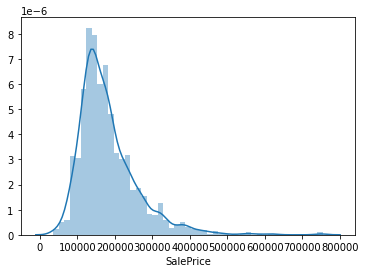


```python
train_data['SalePrice'].describe(percentiles=[0.25,0.5,0.75,0.8,0.9,0.95,0.99])
```


    count      1460.000000
    mean     180921.195890
    std       79442.502883
    min       34900.000000
    25%      129975.000000
    50%      163000.000000
    75%      214000.000000
    80%      230000.000000
    90%      278000.000000
    95%      326100.000000
    99%      442567.010000
    max      755000.000000
    Name: SalePrice, dtype: float64


The data seems to be right skewed with some exceptionally high values. We can consider to keep or drop these instances. 
Since the competition will judge us based on RMSE, many outliers may lead our prediction to be heavily penalized. 


```python
fig=plt.subplots(figsize=(15,10))
fig=plt.scatter(range(len(train_data)),train_data['SalePrice'])
```


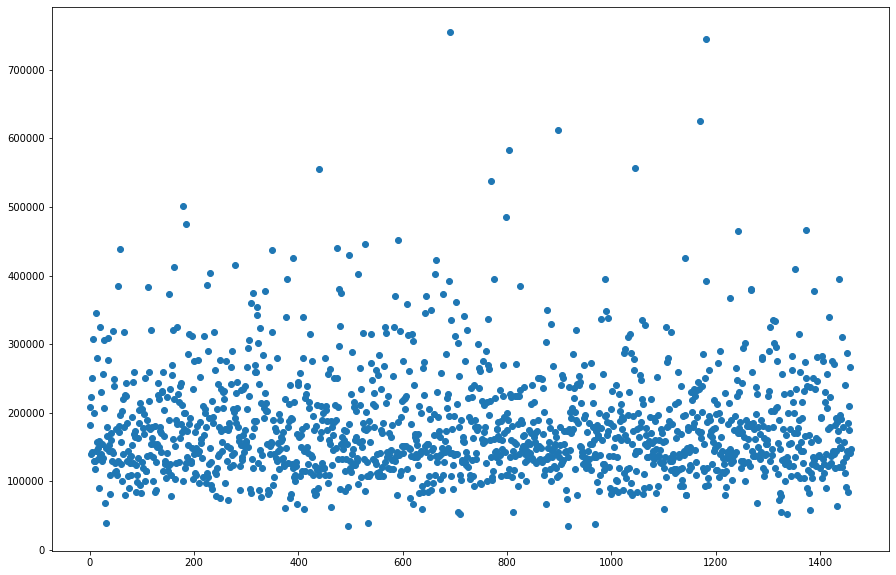


We can see that the distribution of SalePrice across instances is random, there has been no extraordinary pattern in data collection

Now Let's do the correlation matrix


```python
fig=plt.subplots(figsize=(15,10))
corr=train_data.corr()
fig=sns.heatmap(corr)
```


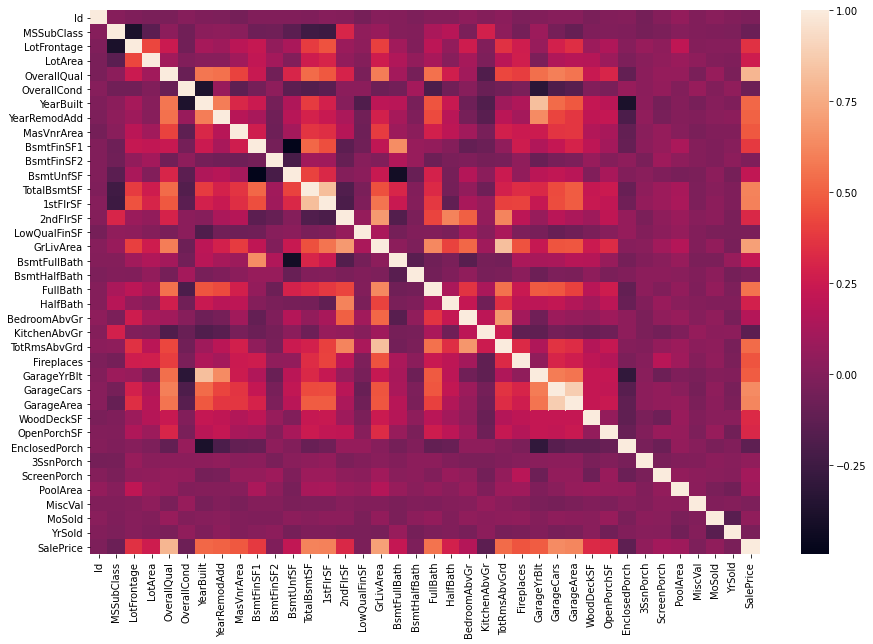


We can choose to focus only on the variables that have highest correlation with SalePrice.


```python
k=15
corrmat=corr.nlargest(k,'SalePrice').index #this syntax will sort "SalePrice" column in "corr" and select k=15 largest values
corrmat
```


    Index(['SalePrice', 'OverallQual', 'GrLivArea', 'GarageCars', 'GarageArea',
           'TotalBsmtSF', '1stFlrSF', 'FullBath', 'TotRmsAbvGrd', 'YearBuilt',
           'YearRemodAdd', 'GarageYrBlt', 'MasVnrArea', 'Fireplaces',
           'BsmtFinSF1'],
          dtype='object')


```python
fig=plt.subplots(figsize=(15,10))
cm=train_data[corrmat].corr()
sns.heatmap(cm,yticklabels=corrmat.values,xticklabels=corrmat.values,annot=True)
plt.show()
```


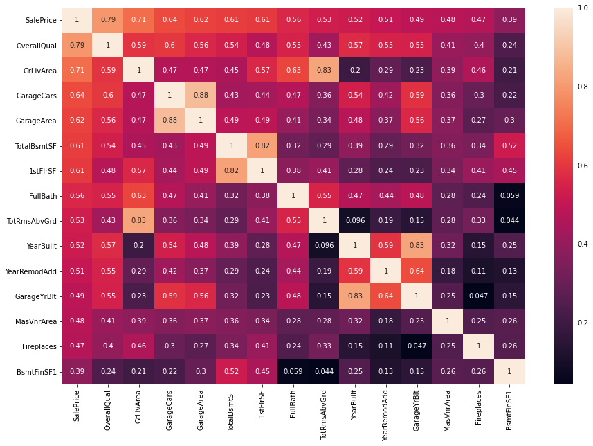


According to this correlation matrix, we see that OverallQual and CrLivArea are 2 features that have high correlation with SalePrice

There are some points to consider

- GrLivArea has high correlation with TotRmsAbvGrd. Thus, I will choose to keep GrLivArea. It is intuitive that people might prefer having larger space to live rather than many small and congested rooms. In addition, information related to number of rooms is already incorporated in some features such as BedroomAbvGr, KitchenAbvGr. 
- GarageCars and Garage Area have high correlation and they seem to deliver similar information.
- TotalBsmtSF and 1stFlrSF also correlate strongly. Since they all point out the space of a house, I will analyze further features related to space such as GrLivArea, TotalBsmtSF... in order to explore more insights.
- It is understandable that GarageYrBlt and YearBuilt move at the same distance. It is probable that most houses have their Garage built at the same time of the whole building construction.

### 2. GrLivArea and related features <a class="anchor" id="GrLivArea"></a>

Let's first explore GrLivArea


```python
ax1=plt.scatter(train_data['GrLivArea'],train_data['SalePrice'])
plt.xlabel('GrLivArea')
plt.ylabel('SalePrice')
```


    Text(0, 0.5, 'SalePrice')


```python
sns.distplot(train_data['GrLivArea'])
plt.show()
```


The distribution of GrLivArea is right skewed with 2 outliers on 4500-5500 m2. We can consider to use the log transformation or drop these 2 outliars


```python
plt.scatter(np.log(train_data['GrLivArea']),np.log(train_data['SalePrice']))
```


    <matplotlib.collections.PathCollection at 0x1eeb6f17e48>


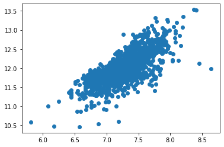


There is a stronger dependence between SalePrice and GrLivArea when we take the log transformation of them. This fortifies our decision to use the log of SalePrice and GrLivArea for linear regression

We may also want to check if the test data has similar distribution with training data. Any abnormal difference will likely make our model unlikely to give satisfactory outcome


```python
fig=plt.figure()

ax1=plt.subplot(121)

ax1=sns.distplot(test_data.GrLivArea)
ax1.set_title('Test_data')

ax2=plt.subplot(122)
ax2.set_title('Train_data')
ax2=sns.distplot(train_data.GrLivArea)
```


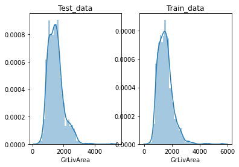


Now Let's analyze GrLivArea with other related features to derive new insights


```python
df=train_data[['GrLivArea','TotRmsAbvGrd','TotalBsmtSF', '1stFlrSF', '2ndFlrSF', 'FullBath', 'HalfBath', 'BedroomAbvGr', 'KitchenAbvGr','SalePrice']]
df.info()
```

    <class 'pandas.core.frame.DataFrame'>
    RangeIndex: 1460 entries, 0 to 1459
    Data columns (total 10 columns):
     #   Column        Non-Null Count  Dtype
    ---  ------        --------------  -----
     0   GrLivArea     1460 non-null   int64
     1   TotRmsAbvGrd  1460 non-null   int64
     2   TotalBsmtSF   1460 non-null   int64
     3   1stFlrSF      1460 non-null   int64
     4   2ndFlrSF      1460 non-null   int64
     5   FullBath      1460 non-null   int64
     6   HalfBath      1460 non-null   int64
     7   BedroomAbvGr  1460 non-null   int64
     8   KitchenAbvGr  1460 non-null   int64
     9   SalePrice     1460 non-null   int64
    dtypes: int64(10)
    memory usage: 114.2 KB
    


```python
dt=test_data[['GrLivArea','TotRmsAbvGrd','TotalBsmtSF', '1stFlrSF', '2ndFlrSF', 'FullBath', 'HalfBath', 'BedroomAbvGr', 'KitchenAbvGr']]
dt.info()
```

    <class 'pandas.core.frame.DataFrame'>
    RangeIndex: 1459 entries, 0 to 1458
    Data columns (total 9 columns):
     #   Column        Non-Null Count  Dtype  
    ---  ------        --------------  -----  
     0   GrLivArea     1459 non-null   int64  
     1   TotRmsAbvGrd  1459 non-null   int64  
     2   TotalBsmtSF   1458 non-null   float64
     3   1stFlrSF      1459 non-null   int64  
     4   2ndFlrSF      1459 non-null   int64  
     5   FullBath      1459 non-null   int64  
     6   HalfBath      1459 non-null   int64  
     7   BedroomAbvGr  1459 non-null   int64  
     8   KitchenAbvGr  1459 non-null   int64  
    dtypes: float64(1), int64(8)
    memory usage: 102.7 KB
    


```python
df_copy=df[['GrLivArea','1stFlrSF', '2ndFlrSF','TotalBsmtSF','SalePrice']]
sns.pairplot(df_copy)
```


    <seaborn.axisgrid.PairGrid at 0x1eeb74b6148>


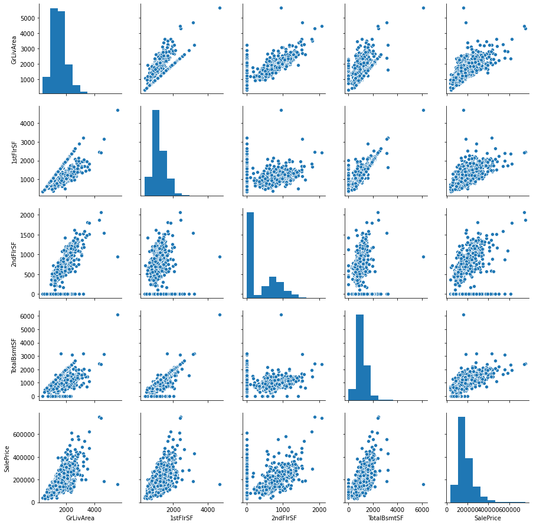


```python
df_copy=df[['FullBath','HalfBath','TotRmsAbvGrd', 'BedroomAbvGr','KitchenAbvGr','SalePrice']]
sns.pairplot(df_copy)
```


    <seaborn.axisgrid.PairGrid at 0x1eeb7d4e4c8>


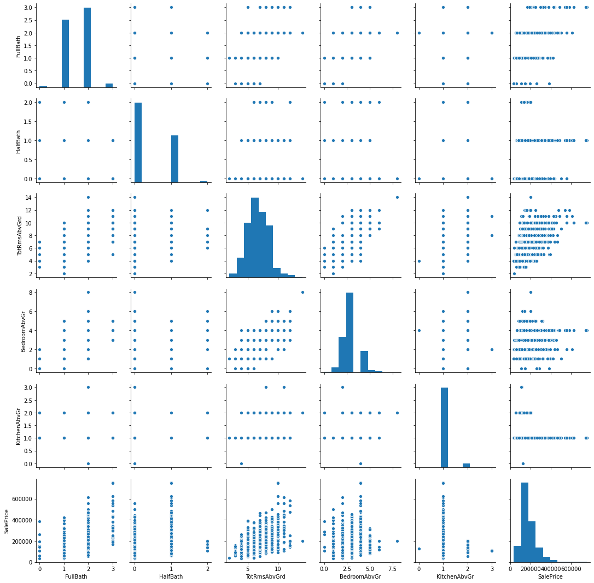


We can generate a feature called as Average Space per Room to see how it correlates with SalePrice. This is based on the assumption that people prefer bigger rooms than many small & confined rooms


```python
df['SpacePerRoom']=df['GrLivArea']/df['TotRmsAbvGrd']
```


```python
plt.scatter(df['SpacePerRoom'],train_data['SalePrice'])
```


    <matplotlib.collections.PathCollection at 0x1eeba74ddc8>


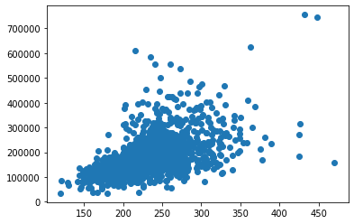


```python
df.corr()
```


<div>
<style scoped>
    .dataframe tbody tr th:only-of-type {
        vertical-align: middle;
    }

    .dataframe tbody tr th {
        vertical-align: top;
    }

    .dataframe thead th {
        text-align: right;
    }
</style>
<table border="1" class="dataframe">
  <thead>
    <tr style="text-align: right;">
      <th></th>
      <th>GrLivArea</th>
      <th>TotRmsAbvGrd</th>
      <th>TotalBsmtSF</th>
      <th>1stFlrSF</th>
      <th>2ndFlrSF</th>
      <th>FullBath</th>
      <th>HalfBath</th>
      <th>BedroomAbvGr</th>
      <th>KitchenAbvGr</th>
      <th>SalePrice</th>
      <th>SpacePerRoom</th>
    </tr>
  </thead>
  <tbody>
    <tr>
      <th>GrLivArea</th>
      <td>1.000000</td>
      <td>0.825489</td>
      <td>0.454868</td>
      <td>0.566024</td>
      <td>0.687501</td>
      <td>0.630012</td>
      <td>0.415772</td>
      <td>0.521270</td>
      <td>0.100063</td>
      <td>0.708624</td>
      <td>0.653820</td>
    </tr>
    <tr>
      <th>TotRmsAbvGrd</th>
      <td>0.825489</td>
      <td>1.000000</td>
      <td>0.285573</td>
      <td>0.409516</td>
      <td>0.616423</td>
      <td>0.554784</td>
      <td>0.343415</td>
      <td>0.676620</td>
      <td>0.256045</td>
      <td>0.533723</td>
      <td>0.144031</td>
    </tr>
    <tr>
      <th>TotalBsmtSF</th>
      <td>0.454868</td>
      <td>0.285573</td>
      <td>1.000000</td>
      <td>0.819530</td>
      <td>-0.174512</td>
      <td>0.323722</td>
      <td>-0.048804</td>
      <td>0.050450</td>
      <td>-0.068901</td>
      <td>0.613581</td>
      <td>0.395858</td>
    </tr>
    <tr>
      <th>1stFlrSF</th>
      <td>0.566024</td>
      <td>0.409516</td>
      <td>0.819530</td>
      <td>1.000000</td>
      <td>-0.202646</td>
      <td>0.380637</td>
      <td>-0.119916</td>
      <td>0.127401</td>
      <td>0.068101</td>
      <td>0.605852</td>
      <td>0.438472</td>
    </tr>
    <tr>
      <th>2ndFlrSF</th>
      <td>0.687501</td>
      <td>0.616423</td>
      <td>-0.174512</td>
      <td>-0.202646</td>
      <td>1.000000</td>
      <td>0.421378</td>
      <td>0.609707</td>
      <td>0.502901</td>
      <td>0.059306</td>
      <td>0.319334</td>
      <td>0.392742</td>
    </tr>
    <tr>
      <th>FullBath</th>
      <td>0.630012</td>
      <td>0.554784</td>
      <td>0.323722</td>
      <td>0.380637</td>
      <td>0.421378</td>
      <td>1.000000</td>
      <td>0.136381</td>
      <td>0.363252</td>
      <td>0.133115</td>
      <td>0.560664</td>
      <td>0.402252</td>
    </tr>
    <tr>
      <th>HalfBath</th>
      <td>0.415772</td>
      <td>0.343415</td>
      <td>-0.048804</td>
      <td>-0.119916</td>
      <td>0.609707</td>
      <td>0.136381</td>
      <td>1.000000</td>
      <td>0.226651</td>
      <td>-0.068263</td>
      <td>0.284108</td>
      <td>0.296526</td>
    </tr>
    <tr>
      <th>BedroomAbvGr</th>
      <td>0.521270</td>
      <td>0.676620</td>
      <td>0.050450</td>
      <td>0.127401</td>
      <td>0.502901</td>
      <td>0.363252</td>
      <td>0.226651</td>
      <td>1.000000</td>
      <td>0.198597</td>
      <td>0.168213</td>
      <td>0.030601</td>
    </tr>
    <tr>
      <th>KitchenAbvGr</th>
      <td>0.100063</td>
      <td>0.256045</td>
      <td>-0.068901</td>
      <td>0.068101</td>
      <td>0.059306</td>
      <td>0.133115</td>
      <td>-0.068263</td>
      <td>0.198597</td>
      <td>1.000000</td>
      <td>-0.135907</td>
      <td>-0.110110</td>
    </tr>
    <tr>
      <th>SalePrice</th>
      <td>0.708624</td>
      <td>0.533723</td>
      <td>0.613581</td>
      <td>0.605852</td>
      <td>0.319334</td>
      <td>0.560664</td>
      <td>0.284108</td>
      <td>0.168213</td>
      <td>-0.135907</td>
      <td>1.000000</td>
      <td>0.540645</td>
    </tr>
    <tr>
      <th>SpacePerRoom</th>
      <td>0.653820</td>
      <td>0.144031</td>
      <td>0.395858</td>
      <td>0.438472</td>
      <td>0.392742</td>
      <td>0.402252</td>
      <td>0.296526</td>
      <td>0.030601</td>
      <td>-0.110110</td>
      <td>0.540645</td>
      <td>1.000000</td>
    </tr>
  </tbody>
</table>
</div>


Using feature SpacePerRoom also results in lower correlation with GrLivArea than that of TotRmsAbvGrd, so I decided to keep this feature and drop the TotalRmsAbvGrd instead.

Regarding KitchenAbvGr, Half Bath and BedroomAbvGr, what I found is that house price does not increase in accordance with the increase in the number of rooms. As for Kitchen, it is apparent that houses with 1 kitchen have higher price.

Thus, to reduce the cardinality of data, I will create new features based on these variables by grouping unique values.


```python
#Houses with 1 kitchen is labeled as 1 while the remainins are named 0
df['OneKitchen']=df.KitchenAbvGr.apply(lambda x:1 if x==1 else 0)
plt.figure(figsize=(5,7))
sns.boxplot(df.OneKitchen,df.SalePrice)
```


    <AxesSubplot:xlabel='OneKitchen', ylabel='SalePrice'>


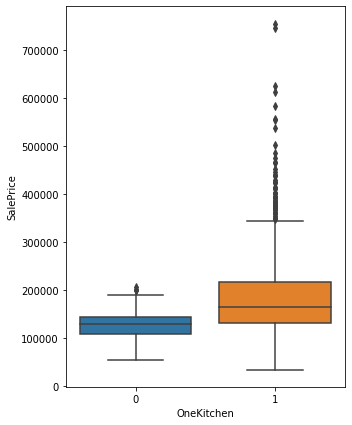


```python
#Houses with 1 to 4 bedrooms are classified as 1
df['BelowFiveBedroom']=df.BedroomAbvGr.apply(lambda x:1 if 0<x<5 else 0)
plt.figure(figsize=(5,7))
sns.boxplot(df.BelowFiveBedroom,df.SalePrice)
```


    <AxesSubplot:xlabel='BelowFiveBedroom', ylabel='SalePrice'>


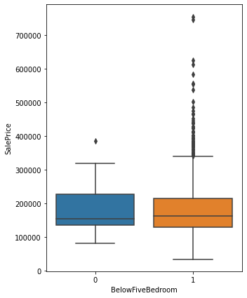


```python
# Houses with 1 Half-Bathroom are labled as 1
df['OneHalfBath']=df.HalfBath.apply(lambda x:1 if x==1 else 0)
plt.figure(figsize=(5,7))
sns.boxplot(df.OneHalfBath,df.SalePrice)
```


    <AxesSubplot:xlabel='OneHalfBath', ylabel='SalePrice'>


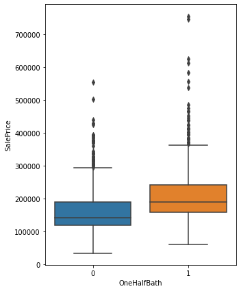


The relationship between sales price and these features is now more obvious, with properties labeled as 1 having higher sales price

To sum up:

- We will keep GrLivArea, 1stFlrSF, 2ndFlrSF, FullBath, KitchenAbvGr.

- We will also add new features: SpacePerRoom, OneHalfBath, BelowFiveBedroom and OneKitchen

- We will drop TotRmsAbvGrd (highly correlates with GrLivArea).

- Keep both TotalBsmtSF and 1stFlrSF. Consider to drop after running models with feature selection such as Lasso Regression and RandomForest Regressor.

### 3. Garage and its related features 


```python
df=train_data[['GarageCars','GarageArea','SalePrice']]
df.info()
```

    <class 'pandas.core.frame.DataFrame'>
    RangeIndex: 1460 entries, 0 to 1459
    Data columns (total 3 columns):
     #   Column      Non-Null Count  Dtype
    ---  ------      --------------  -----
     0   GarageCars  1460 non-null   int64
     1   GarageArea  1460 non-null   int64
     2   SalePrice   1460 non-null   int64
    dtypes: int64(3)
    memory usage: 34.3 KB
    


```python
dt=test_data[['GarageCars','GarageArea','GarageYrBlt']]
dt.info()
```

    <class 'pandas.core.frame.DataFrame'>
    RangeIndex: 1459 entries, 0 to 1458
    Data columns (total 3 columns):
     #   Column       Non-Null Count  Dtype  
    ---  ------       --------------  -----  
     0   GarageCars   1458 non-null   float64
     1   GarageArea   1458 non-null   float64
     2   GarageYrBlt  1381 non-null   float64
    dtypes: float64(3)
    memory usage: 34.3 KB
    


```python
sns.boxplot(df['GarageCars'],df['SalePrice'])
```


    <AxesSubplot:xlabel='GarageCars', ylabel='SalePrice'>


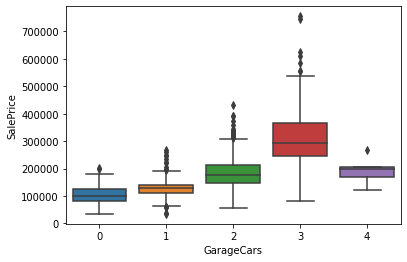


```python
plt.scatter(df['GarageArea'],np.log1p(df['SalePrice']))
```


    <matplotlib.collections.PathCollection at 0x1eebbe32b08>


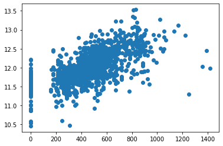


From my viewpoint, it is better to use feature GarageCars for faster model learning. It might be more sensible to predict how raising capacity of garage by 1 car, in lieu of by 1 m2, will impact the sales price. The price increase will be more noticeable from a 1-car to a 2 car-garage, rather than from a 100 m2-garage to a 101 m2-garage.

To bring linear relationship, we can generate a new feature, 1 for those having >=2 cars and 0 for those <2 cars.


```python
def group(row):
    if row['GarageCars'] >=2:
        return 1
    else: 
        return 0
        
df['Carcount']=df.apply(group,axis=1)
```


```python
#Another method is to use lambda function
#df['Car_count']=train_data['GarageCars'].apply(lambda x: 1 if x>=2 else 0)
#df.head(5)
```


```python
df.groupby('Carcount')['SalePrice'].agg(np.median)
```


    Carcount
    0    125000
    1    186600
    Name: SalePrice, dtype: int64


```python
df.groupby('Carcount')['SalePrice'].agg(np.mean)
```


    Carcount
    0    123652.795556
    1    206436.819802
    Name: SalePrice, dtype: float64


We can choose to drop "GarageCars" and "GarageArea" and keep "Car_Count" in regression

### 4. YearBuilt and related features


```python
df=train_data[['YrSold','YearRemodAdd','YearBuilt','GarageYrBlt','SalePrice']]
df.info()
```

    <class 'pandas.core.frame.DataFrame'>
    RangeIndex: 1460 entries, 0 to 1459
    Data columns (total 5 columns):
     #   Column        Non-Null Count  Dtype  
    ---  ------        --------------  -----  
     0   YrSold        1460 non-null   int64  
     1   YearRemodAdd  1460 non-null   int64  
     2   YearBuilt     1460 non-null   int64  
     3   GarageYrBlt   1379 non-null   float64
     4   SalePrice     1460 non-null   int64  
    dtypes: float64(1), int64(4)
    memory usage: 57.2 KB
    


```python
corr=df.corr()
sns.heatmap(corr,annot=True)
```


    <AxesSubplot:>


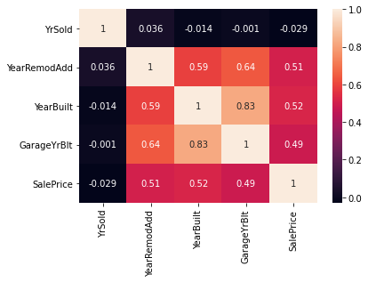


I will create an "Age" feature, indicating the Age of the Building. We can easily make an assumption that as the houses become aging, their sale prices will also decrease


```python
df['Age']=df.YrSold-df.YearBuilt
plt.scatter(df.Age,df.SalePrice)
```


    <matplotlib.collections.PathCollection at 0x1eebbf7e608>


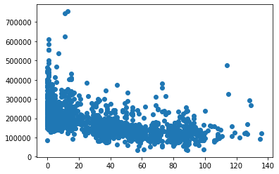


I will also create a feature called RemodAge to measure the time since a house was remodeled until it was sold.


```python
df['RemodAge']=df.YrSold-df.YearRemodAdd
plt.scatter(df.RemodAge,df.SalePrice)
```


    <matplotlib.collections.PathCollection at 0x1eebc01e308>


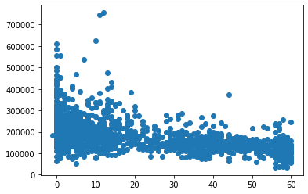


```python
corr=df[['Age','RemodAge','SalePrice']].corr()
sns.heatmap(corr,annot=True)
```


    <AxesSubplot:>


Finally, I will drop YearBult, GarageYrBlt, YearRemodAdd and YearSold and only keep 2 Age variables

### 5. Handling Missing Values for Numeric Features

Before applying feature engineering we did before to train data, I would like to work with missing values and outliers first


```python
total=train_data.loc[:,quantitative].isnull().sum()
percent=total/(train_data.isnull().count())
missing_df=pd.concat([total,percent],axis=1,keys=["Value","Percent"]).sort_values(by='Percent',ascending=False)
missing_df.loc[missing_df['Value']>0]
```


<div>
<style scoped>
    .dataframe tbody tr th:only-of-type {
        vertical-align: middle;
    }

    .dataframe tbody tr th {
        vertical-align: top;
    }

    .dataframe thead th {
        text-align: right;
    }
</style>
<table border="1" class="dataframe">
  <thead>
    <tr style="text-align: right;">
      <th></th>
      <th>Value</th>
      <th>Percent</th>
    </tr>
  </thead>
  <tbody>
    <tr>
      <th>LotFrontage</th>
      <td>259.0</td>
      <td>0.177397</td>
    </tr>
    <tr>
      <th>GarageYrBlt</th>
      <td>81.0</td>
      <td>0.055479</td>
    </tr>
    <tr>
      <th>MasVnrArea</th>
      <td>8.0</td>
      <td>0.005479</td>
    </tr>
  </tbody>
</table>
</div>


```python
test_quantitative=[f for f in quantitative if f !='SalePrice']
total_test=test_data.loc[:,test_quantitative].isnull().sum()
percent=total/(test_data.isnull().count())
missing_df=pd.concat([total,percent],axis=1,keys=["Value","Percent"]).sort_values(by='Percent',ascending=False)
missing_df.loc[missing_df['Value']>0]
```


<div>
<style scoped>
    .dataframe tbody tr th:only-of-type {
        vertical-align: middle;
    }

    .dataframe tbody tr th {
        vertical-align: top;
    }

    .dataframe thead th {
        text-align: right;
    }
</style>
<table border="1" class="dataframe">
  <thead>
    <tr style="text-align: right;">
      <th></th>
      <th>Value</th>
      <th>Percent</th>
    </tr>
  </thead>
  <tbody>
    <tr>
      <th>LotFrontage</th>
      <td>259.0</td>
      <td>0.177519</td>
    </tr>
    <tr>
      <th>GarageYrBlt</th>
      <td>81.0</td>
      <td>0.055517</td>
    </tr>
    <tr>
      <th>MasVnrArea</th>
      <td>8.0</td>
      <td>0.005483</td>
    </tr>
  </tbody>
</table>
</div>


My principle is that those variables with more than 15% missing values will be eliminated completely


```python
train_data.drop(missing_df.loc[missing_df.Percent > 0.15].index,axis=1,inplace=True)
test_data.drop(missing_df.loc[missing_df.Percent > 0.15].index,axis=1,inplace=True)
```

There are variables that are missing simply because of the nature. For example, if we check Garage, the variables related to Garage are missing some instances because these houses do not have any Garage


```python
train_data.loc[train_data.GarageYrBlt.isnull(),'GarageCars'].sum()
```


    0


Thus, I will impute NA values in GarageYrBlt with zero


```python
train_data['GarageYrBlt']=train_data['GarageYrBlt'].fillna(0)
test_data['GarageYrBlt']=test_data['GarageYrBlt'].fillna(0)
```


```python
train_data.GarageYrBlt.isnull().sum()
```


    0


It is also likely that the null values for MasVnrArea result from the fact that the properties do not have Masonry veneer


```python
train_data.loc[train_data.MasVnrArea.isnull(),['MasVnrType']]
```


<div>
<style scoped>
    .dataframe tbody tr th:only-of-type {
        vertical-align: middle;
    }

    .dataframe tbody tr th {
        vertical-align: top;
    }

    .dataframe thead th {
        text-align: right;
    }
</style>
<table border="1" class="dataframe">
  <thead>
    <tr style="text-align: right;">
      <th></th>
      <th>MasVnrType</th>
    </tr>
  </thead>
  <tbody>
    <tr>
      <th>234</th>
      <td>NaN</td>
    </tr>
    <tr>
      <th>529</th>
      <td>NaN</td>
    </tr>
    <tr>
      <th>650</th>
      <td>NaN</td>
    </tr>
    <tr>
      <th>936</th>
      <td>NaN</td>
    </tr>
    <tr>
      <th>973</th>
      <td>NaN</td>
    </tr>
    <tr>
      <th>977</th>
      <td>NaN</td>
    </tr>
    <tr>
      <th>1243</th>
      <td>NaN</td>
    </tr>
    <tr>
      <th>1278</th>
      <td>NaN</td>
    </tr>
  </tbody>
</table>
</div>


```python
train_data['MasVnrArea']=train_data['MasVnrArea'].fillna(0)
test_data['MasVnrArea']=test_data['MasVnrArea'].fillna(0)

```

Now let's apply the previous feature engineering methods into numeric values:

- We will keep GrLivArea, 1stFlrSF, 2ndFlrSF, FullBath, KitchenAbvGr.

- We will also add new features: SpacePerRoom, OneHalfBath, BelowFiveBedroom and OneKitchen

- We will drop TotRmsAbvGrd (highly correlates with GrLivArea).

- Keep both TotalBsmtSF and 1stFlrSF. Consider to drop after running models with feature selection such as Lasso Regression and RandomForest Regressor.


```python
def numeric_transform(df):
    df['OneKitchen']=df['KitchenAbvGr'].apply(lambda x:1 if x==1 else 0)
    df['BelowFiveBedroom']=df.BedroomAbvGr.apply(lambda x:1 if 0<x<5 else 0)
    df['OneHalfBath']=df.HalfBath.apply(lambda x:1 if x==1 else 0)
    df['SpacePerRoom']=df['GrLivArea']/df['TotRmsAbvGrd']
    def group(row):
        if row['GarageCars'] >=2:
            return 1
        else: 
            return 0
        
    df['Carcount']=df.apply(group,axis=1)
    df['Age']=df.YrSold-df.YearBuilt
    df['RemodAge']=df.YrSold-df.YearRemodAdd
    
    return df


    
    
```


```python
train_data=numeric_transform(train_data)
```


```python
test_data=numeric_transform(test_data)
```

## 3. Categorical Variables  <a class="anchor" id="category"></a>

We will focus on ordinal features that are somehow related to the numeric features that are considered to be influential:

a) Ordinal variables
1. BsmtQual
2. GarageQual and GarageCond (consider if these 2 features are duplicate)
3. Utilities (I considered it to have high impact)
4. Functional (previously considered high impact)

b) Nominal variables

1. Neighborhood
2. SaleCondition
3. SaleType
4. MSZoning


### 1. Ordinal Variables 


```python
ordinal_df=train_data[['Utilities','LandSlope','ExterQual','ExterCond','BsmtQual','BsmtCond','BsmtExposure','BsmtFinType1','BsmtFinType2','HeatingQC','CentralAir','BsmtFullBath','BsmtHalfBath','KitchenQual','Functional','FireplaceQu','GarageFinish','GarageQual','GarageCond','PavedDrive','PoolQC']]
ordinal_df.info()
```

    <class 'pandas.core.frame.DataFrame'>
    RangeIndex: 1460 entries, 0 to 1459
    Data columns (total 21 columns):
     #   Column        Non-Null Count  Dtype 
    ---  ------        --------------  ----- 
     0   Utilities     1460 non-null   object
     1   LandSlope     1460 non-null   object
     2   ExterQual     1460 non-null   object
     3   ExterCond     1460 non-null   object
     4   BsmtQual      1423 non-null   object
     5   BsmtCond      1423 non-null   object
     6   BsmtExposure  1422 non-null   object
     7   BsmtFinType1  1423 non-null   object
     8   BsmtFinType2  1422 non-null   object
     9   HeatingQC     1460 non-null   object
     10  CentralAir    1460 non-null   object
     11  BsmtFullBath  1460 non-null   int64 
     12  BsmtHalfBath  1460 non-null   int64 
     13  KitchenQual   1460 non-null   object
     14  Functional    1460 non-null   object
     15  FireplaceQu   770 non-null    object
     16  GarageFinish  1379 non-null   object
     17  GarageQual    1379 non-null   object
     18  GarageCond    1379 non-null   object
     19  PavedDrive    1460 non-null   object
     20  PoolQC        7 non-null      object
    dtypes: int64(2), object(19)
    memory usage: 239.7+ KB
    


```python
ordinal_dt=test_data[['Utilities','LandSlope','ExterQual','ExterCond','BsmtQual','BsmtCond','BsmtExposure','BsmtFinType1','BsmtFinType2','HeatingQC','CentralAir','BsmtFullBath','BsmtHalfBath','KitchenQual','Functional','FireplaceQu','GarageFinish','GarageQual','GarageCond','PavedDrive','PoolQC']]
ordinal_dt.info()
```

    <class 'pandas.core.frame.DataFrame'>
    RangeIndex: 1459 entries, 0 to 1458
    Data columns (total 21 columns):
     #   Column        Non-Null Count  Dtype  
    ---  ------        --------------  -----  
     0   Utilities     1457 non-null   object 
     1   LandSlope     1459 non-null   object 
     2   ExterQual     1459 non-null   object 
     3   ExterCond     1459 non-null   object 
     4   BsmtQual      1415 non-null   object 
     5   BsmtCond      1414 non-null   object 
     6   BsmtExposure  1415 non-null   object 
     7   BsmtFinType1  1417 non-null   object 
     8   BsmtFinType2  1417 non-null   object 
     9   HeatingQC     1459 non-null   object 
     10  CentralAir    1459 non-null   object 
     11  BsmtFullBath  1457 non-null   float64
     12  BsmtHalfBath  1457 non-null   float64
     13  KitchenQual   1458 non-null   object 
     14  Functional    1457 non-null   object 
     15  FireplaceQu   729 non-null    object 
     16  GarageFinish  1381 non-null   object 
     17  GarageQual    1381 non-null   object 
     18  GarageCond    1381 non-null   object 
     19  PavedDrive    1459 non-null   object 
     20  PoolQC        3 non-null      object 
    dtypes: float64(2), object(19)
    memory usage: 239.5+ KB
    

PoolQC and FireplaceQu will be eliminated from our dataset since they have many missing values.

Based on the variables understanding, I will encode the ordinal features using numeric scale. Higher number is assumed to increase sale price. 


```python
ordinal_df = ordinal_df.replace({"Alley" : {"Grvl" : 1, "Pave" : 2},
                       "BsmtCond" : {"No" : 0, "Po" : 1, "Fa" : 2, "TA" : 3, "Gd" : 4, "Ex" : 5},
                       "BsmtExposure" : {"No" : 0, "Mn" : 1, "Av": 2, "Gd" : 3},
                       "BsmtFinType1" : {"No" : 0, "Unf" : 1, "LwQ": 2, "Rec" : 3, "BLQ" : 4, 
                                         "ALQ" : 5, "GLQ" : 6},
    
    "BsmtFinType2" : {"No" : 0, "Unf" : 1, "LwQ": 2, "Rec" : 3, "BLQ" : 4, 
                                         "ALQ" : 5, "GLQ" : 6},
                       "BsmtQual" : {"No" : 0, "Po" : 1, "Fa" : 2, "TA": 3, "Gd" : 4, "Ex" : 5},
                       "ExterCond" : {"Po" : 1, "Fa" : 2, "TA": 3, "Gd": 4, "Ex" : 5},
                       "ExterQual" : {"Po" : 1, "Fa" : 2, "TA": 3, "Gd": 4, "Ex" : 5},
                       "Functional" : {"Sal" : 1, "Sev" : 2, "Maj2" : 3, "Maj1" : 4, "Mod": 5, 
                                       "Min2" : 6, "Min1" : 7, "Typ" : 8},
                       "GarageCond" : {"No" : 0, "Po" : 1, "Fa" : 2, "TA" : 3, "Gd" : 4, "Ex" : 5},
                       "GarageFinish": {'Fin':1,'RFn':0.8,'Unf':0.5,'No':0},
                       "GarageQual" : {"No" : 0, "Po" : 1, "Fa" : 2, "TA" : 3, "Gd" : 4, "Ex" : 5},
                       "HeatingQC" : {"Po" : 1, "Fa" : 2, "TA" : 3, "Gd" : 4, "Ex" : 5},
                       "KitchenQual" : {"Po" : 1, "Fa" : 2, "TA" : 3, "Gd" : 4, "Ex" : 5},
                       "LandSlope" : {"Sev" : 1, "Mod" : 2, "Gtl" : 3},
                       "LotShape" : {"IR3" : 1, "IR2" : 2, "IR1" : 3, "Reg" : 4},
                       "PavedDrive" : {"N" : 0, "P" : 1, "Y" : 2},
                       "Street" : {"Grvl" : 1, "Pave" : 2},
                       "Utilities" : {"ELO" : 1, "NoSeWa" : 2, "NoSewr" : 3, "AllPub" : 4},
                                "CentralAir":{"Y":1,"N":0}}
                     )

ordinal_df['SalePrice']=train_data['SalePrice']
```


```python
fig=plt.figure(figsize=(15,10))
ordinal_cor=pd.DataFrame(np.round(ordinal_df.corr(),2))
#ordinal_cor=ordinal_cor.sort_values(by='SalePrice',ascending=False)
fig=sns.heatmap(ordinal_cor,annot=True)

```


It is interesting to see that the variables related to "Qual" (Quality) have high impact to SalePrice


```python
ordinal=[f for f in ordinal_df.columns if f != 'SalePrice']
tr=pd.melt(ordinal_df,value_vars=ordinal,id_vars='SalePrice')
tr
```


<div>
<style scoped>
    .dataframe tbody tr th:only-of-type {
        vertical-align: middle;
    }

    .dataframe tbody tr th {
        vertical-align: top;
    }

    .dataframe thead th {
        text-align: right;
    }
</style>
<table border="1" class="dataframe">
  <thead>
    <tr style="text-align: right;">
      <th></th>
      <th>SalePrice</th>
      <th>variable</th>
      <th>value</th>
    </tr>
  </thead>
  <tbody>
    <tr>
      <th>0</th>
      <td>208500</td>
      <td>Utilities</td>
      <td>4</td>
    </tr>
    <tr>
      <th>1</th>
      <td>181500</td>
      <td>Utilities</td>
      <td>4</td>
    </tr>
    <tr>
      <th>2</th>
      <td>223500</td>
      <td>Utilities</td>
      <td>4</td>
    </tr>
    <tr>
      <th>3</th>
      <td>140000</td>
      <td>Utilities</td>
      <td>4</td>
    </tr>
    <tr>
      <th>4</th>
      <td>250000</td>
      <td>Utilities</td>
      <td>4</td>
    </tr>
    <tr>
      <th>...</th>
      <td>...</td>
      <td>...</td>
      <td>...</td>
    </tr>
    <tr>
      <th>30655</th>
      <td>175000</td>
      <td>PoolQC</td>
      <td>NaN</td>
    </tr>
    <tr>
      <th>30656</th>
      <td>210000</td>
      <td>PoolQC</td>
      <td>NaN</td>
    </tr>
    <tr>
      <th>30657</th>
      <td>266500</td>
      <td>PoolQC</td>
      <td>NaN</td>
    </tr>
    <tr>
      <th>30658</th>
      <td>142125</td>
      <td>PoolQC</td>
      <td>NaN</td>
    </tr>
    <tr>
      <th>30659</th>
      <td>147500</td>
      <td>PoolQC</td>
      <td>NaN</td>
    </tr>
  </tbody>
</table>
<p>30660 rows × 3 columns</p>
</div>


```python
draw=sns.FacetGrid(tr,col='variable',col_wrap=2,sharex=False,sharey=False,size=5)
draw.map(sns.boxplot,'value','SalePrice')

```


    <seaborn.axisgrid.FacetGrid at 0x1eebbd27508>


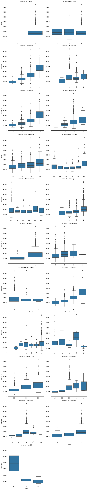


Throught the chart, I decide to drop Utilities since almost all variables are "AllPub". It cannot give us any insight


```python
train_data['Utilities'].value_counts()
```


    AllPub    1459
    NoSeWa       1
    Name: Utilities, dtype: int64


I will also drop GarageCond since it highly correlates with GarageQual and has little  impact to SalePrice


```python
train_data.drop(['GarageCond','Utilities'],axis=1,inplace=True)
test_data.drop(['GarageCond','Utilities'],axis=1,inplace=True)
```

### 2. Nominal variables 


```python
ct_train=train_data[['SalePrice','Neighborhood','MSSubClass','MSZoning','Street','Alley','LotShape','LandContour','LotConfig','Condition1','Condition2','BldgType','HouseStyle','RoofStyle','RoofMatl','Exterior1st','Exterior2nd','MasVnrType','Foundation','Heating','Electrical','GarageType','MiscFeature','SaleType','SaleCondition','Fence']]
ct_train.info()
```

    <class 'pandas.core.frame.DataFrame'>
    RangeIndex: 1460 entries, 0 to 1459
    Data columns (total 26 columns):
     #   Column         Non-Null Count  Dtype 
    ---  ------         --------------  ----- 
     0   SalePrice      1460 non-null   int64 
     1   Neighborhood   1460 non-null   object
     2   MSSubClass     1460 non-null   int64 
     3   MSZoning       1460 non-null   object
     4   Street         1460 non-null   object
     5   Alley          91 non-null     object
     6   LotShape       1460 non-null   object
     7   LandContour    1460 non-null   object
     8   LotConfig      1460 non-null   object
     9   Condition1     1460 non-null   object
     10  Condition2     1460 non-null   object
     11  BldgType       1460 non-null   object
     12  HouseStyle     1460 non-null   object
     13  RoofStyle      1460 non-null   object
     14  RoofMatl       1460 non-null   object
     15  Exterior1st    1460 non-null   object
     16  Exterior2nd    1460 non-null   object
     17  MasVnrType     1452 non-null   object
     18  Foundation     1460 non-null   object
     19  Heating        1460 non-null   object
     20  Electrical     1459 non-null   object
     21  GarageType     1379 non-null   object
     22  MiscFeature    54 non-null     object
     23  SaleType       1460 non-null   object
     24  SaleCondition  1460 non-null   object
     25  Fence          281 non-null    object
    dtypes: int64(2), object(24)
    memory usage: 296.7+ KB
    


```python
ct_test=test_data[['Neighborhood','MSSubClass','MSZoning','Street','Alley','LotShape','LandContour','LotConfig','Condition1','Condition2','BldgType','HouseStyle','RoofStyle','RoofMatl','Exterior1st','Exterior2nd','MasVnrType','Foundation','Heating','Electrical','GarageType','MiscFeature','SaleType','SaleCondition','Fence']]
ct_test.info()
```

    <class 'pandas.core.frame.DataFrame'>
    RangeIndex: 1459 entries, 0 to 1458
    Data columns (total 25 columns):
     #   Column         Non-Null Count  Dtype 
    ---  ------         --------------  ----- 
     0   Neighborhood   1459 non-null   object
     1   MSSubClass     1459 non-null   int64 
     2   MSZoning       1455 non-null   object
     3   Street         1459 non-null   object
     4   Alley          107 non-null    object
     5   LotShape       1459 non-null   object
     6   LandContour    1459 non-null   object
     7   LotConfig      1459 non-null   object
     8   Condition1     1459 non-null   object
     9   Condition2     1459 non-null   object
     10  BldgType       1459 non-null   object
     11  HouseStyle     1459 non-null   object
     12  RoofStyle      1459 non-null   object
     13  RoofMatl       1459 non-null   object
     14  Exterior1st    1458 non-null   object
     15  Exterior2nd    1458 non-null   object
     16  MasVnrType     1443 non-null   object
     17  Foundation     1459 non-null   object
     18  Heating        1459 non-null   object
     19  Electrical     1459 non-null   object
     20  GarageType     1383 non-null   object
     21  MiscFeature    51 non-null     object
     22  SaleType       1458 non-null   object
     23  SaleCondition  1459 non-null   object
     24  Fence          290 non-null    object
    dtypes: int64(1), object(24)
    memory usage: 285.1+ KB
    

I decide to drop MiscFeature and Alley since they have many missing values in both dataset


```python
ct_train.drop(['MiscFeature','Alley'],axis=1,inplace=True)

```


```python
f=[f for f in ct_train.columns if f != "SalePrice"]
tr=pd.melt(ct_train,id_vars='SalePrice',value_vars=f)
draw=sns.FacetGrid(tr,col='variable',col_wrap=2,sharex=False,sharey=False,size=6)
draw.map(sns.boxplot,"value",'SalePrice')
```


    <seaborn.axisgrid.FacetGrid at 0x1eebe199488>


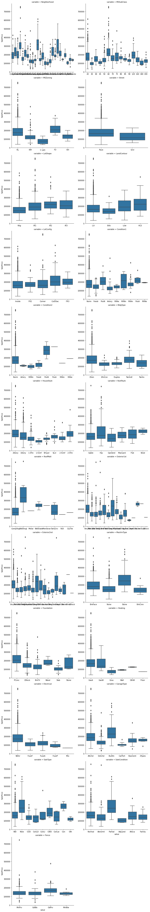


```python
#Have a look at the data cardinality in each nominal variables  
for var in ct_train.columns:
    print( var,"has",len(ct_train[var].unique()),"unique values")
```

    SalePrice has 663 unique values
    Neighborhood has 25 unique values
    MSSubClass has 15 unique values
    MSZoning has 5 unique values
    Street has 2 unique values
    LotShape has 4 unique values
    LandContour has 4 unique values
    LotConfig has 5 unique values
    Condition1 has 9 unique values
    Condition2 has 8 unique values
    BldgType has 5 unique values
    HouseStyle has 8 unique values
    RoofStyle has 6 unique values
    RoofMatl has 8 unique values
    Exterior1st has 15 unique values
    Exterior2nd has 16 unique values
    MasVnrType has 5 unique values
    Foundation has 6 unique values
    Heating has 6 unique values
    Electrical has 6 unique values
    GarageType has 7 unique values
    SaleType has 9 unique values
    SaleCondition has 6 unique values
    Fence has 5 unique values
    

There are different methods to encode nominal variables. 
The most popular ones are Label Encoder and One Hot Encoding


```python
from sklearn.preprocessing import LabelEncoder
LBE=LabelEncoder()
ct_train['SaleCondition_E']=LBE.fit_transform(ct_train['SaleCondition'])
exp=ct_train[['SaleCondition','SaleCondition_E']]
exp.index=exp['SaleCondition']
exp['SaleCondition_E'].to_dict()
```


    {'Normal': 4,
     'Abnorml': 0,
     'Partial': 5,
     'AdjLand': 1,
     'Alloca': 2,
     'Family': 3}


```python
plt.scatter(ct_train['SaleCondition_E'],ct_train['SalePrice'])
```


    <matplotlib.collections.PathCollection at 0x1eec2643f48>


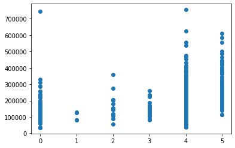


As we can see here, LabelEncode encode the variables very arbitrarily.
Since we have some varibles with relatively high cardinality such as Neighborhood, it is also not sensible to use OneHot Encoding, which creates huge number of columns.


There are other alternative method to encode, namely Target Encoding. This time I will try encode the variable based on order of its mean


```python
def encode(frame,feature):
    ordering=pd.DataFrame()
    ordering['val'] = frame[feature].unique()
    ordering.index = ordering.val
    ordering['spmean'] = frame[[feature, 'SalePrice']].groupby(feature).mean()['SalePrice']
    ordering = ordering.sort_values('spmean')
    ordering['ordering'] = range(1, ordering.shape[0]+1)
    order=ordering['ordering'].to_dict()
    for cat,o in order.items():
        frame.loc[frame[feature]==cat, feature +'_Encode']=o
    

```


```python
category=['Neighborhood','MSSubClass','MSZoning','Street','LotShape','LandContour','LotConfig','Condition1','Condition2','BldgType','HouseStyle','RoofStyle','RoofMatl','Exterior1st','Exterior2nd','MasVnrType','Foundation','Heating','Electrical','GarageType','SaleType','SaleCondition']
```


```python
for q in category:
     encode(ct_train,q)
```


```python
med=ct_train[['Neighborhood','Neighborhood_Encode']]
med.set_index('Neighborhood',inplace=True)
med['Neighborhood_Encode'].to_dict()
```


    {'CollgCr': 17.0,
     'Veenker': 21.0,
     'Crawfor': 18.0,
     'NoRidge': 25.0,
     'Mitchel': 12.0,
     'Somerst': 20.0,
     'NWAmes': 14.0,
     'OldTown': 6.0,
     'BrkSide': 4.0,
     'Sawyer': 7.0,
     'NridgHt': 24.0,
     'NAmes': 11.0,
     'SawyerW': 13.0,
     'IDOTRR': 2.0,
     'MeadowV': 1.0,
     'Edwards': 5.0,
     'Timber': 22.0,
     'Gilbert': 15.0,
     'StoneBr': 23.0,
     'ClearCr': 19.0,
     'NPkVill': 10.0,
     'Blmngtn': 16.0,
     'BrDale': 3.0,
     'SWISU': 9.0,
     'Blueste': 8.0}


```python
sns.boxplot(ct_train['GarageType_Encode'],ct_train['SalePrice'])
```


    <AxesSubplot:xlabel='GarageType_Encode', ylabel='SalePrice'>


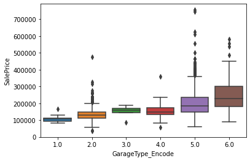


I will also encode test data using this method 


```python
def test_encode(train_frame,test_frame,feature):
    ordering=pd.DataFrame()
    ordering['val'] = train_frame[feature].unique()
    ordering.index = ordering.val
    ordering['spmean'] = train_frame[[feature, 'SalePrice']].groupby(feature).mean()['SalePrice']
    ordering = ordering.sort_values('spmean')
    ordering['ordering'] = range(1, ordering.shape[0]+1)
    order=ordering['ordering'].to_dict()
    for cat,o in order.items():
        test_frame.loc[test_frame[feature]==cat, feature +'_Encode']=o
```

###  3. Handling Missing Values and Data Transformation

Just like numeric variables, I will resolve missing values before performing features transformation


```python
total=train_data.isnull().sum()
percent=total/(train_data.isnull().count())
missing_df=pd.concat([total,percent],axis=1,keys=["Value","Percent"]).sort_values(by='Percent',ascending=False)
missing_df.loc[missing_df['Value']>0]
```


<div>
<style scoped>
    .dataframe tbody tr th:only-of-type {
        vertical-align: middle;
    }

    .dataframe tbody tr th {
        vertical-align: top;
    }

    .dataframe thead th {
        text-align: right;
    }
</style>
<table border="1" class="dataframe">
  <thead>
    <tr style="text-align: right;">
      <th></th>
      <th>Value</th>
      <th>Percent</th>
    </tr>
  </thead>
  <tbody>
    <tr>
      <th>PoolQC</th>
      <td>1453</td>
      <td>0.995205</td>
    </tr>
    <tr>
      <th>MiscFeature</th>
      <td>1406</td>
      <td>0.963014</td>
    </tr>
    <tr>
      <th>Alley</th>
      <td>1369</td>
      <td>0.937671</td>
    </tr>
    <tr>
      <th>Fence</th>
      <td>1179</td>
      <td>0.807534</td>
    </tr>
    <tr>
      <th>FireplaceQu</th>
      <td>690</td>
      <td>0.472603</td>
    </tr>
    <tr>
      <th>GarageQual</th>
      <td>81</td>
      <td>0.055479</td>
    </tr>
    <tr>
      <th>GarageFinish</th>
      <td>81</td>
      <td>0.055479</td>
    </tr>
    <tr>
      <th>GarageType</th>
      <td>81</td>
      <td>0.055479</td>
    </tr>
    <tr>
      <th>BsmtExposure</th>
      <td>38</td>
      <td>0.026027</td>
    </tr>
    <tr>
      <th>BsmtFinType2</th>
      <td>38</td>
      <td>0.026027</td>
    </tr>
    <tr>
      <th>BsmtQual</th>
      <td>37</td>
      <td>0.025342</td>
    </tr>
    <tr>
      <th>BsmtCond</th>
      <td>37</td>
      <td>0.025342</td>
    </tr>
    <tr>
      <th>BsmtFinType1</th>
      <td>37</td>
      <td>0.025342</td>
    </tr>
    <tr>
      <th>MasVnrType</th>
      <td>8</td>
      <td>0.005479</td>
    </tr>
    <tr>
      <th>Electrical</th>
      <td>1</td>
      <td>0.000685</td>
    </tr>
  </tbody>
</table>
</div>


```python
total=test_data.isnull().sum()
percent=total/(test_data.isnull().count())
missing_df=pd.concat([total,percent],axis=1,keys=["Value","Percent"]).sort_values(by='Percent',ascending=False)
missing_df.loc[missing_df['Value']>0]
```


<div>
<style scoped>
    .dataframe tbody tr th:only-of-type {
        vertical-align: middle;
    }

    .dataframe tbody tr th {
        vertical-align: top;
    }

    .dataframe thead th {
        text-align: right;
    }
</style>
<table border="1" class="dataframe">
  <thead>
    <tr style="text-align: right;">
      <th></th>
      <th>Value</th>
      <th>Percent</th>
    </tr>
  </thead>
  <tbody>
    <tr>
      <th>PoolQC</th>
      <td>1456</td>
      <td>0.997944</td>
    </tr>
    <tr>
      <th>MiscFeature</th>
      <td>1408</td>
      <td>0.965045</td>
    </tr>
    <tr>
      <th>Alley</th>
      <td>1352</td>
      <td>0.926662</td>
    </tr>
    <tr>
      <th>Fence</th>
      <td>1169</td>
      <td>0.801234</td>
    </tr>
    <tr>
      <th>FireplaceQu</th>
      <td>730</td>
      <td>0.500343</td>
    </tr>
    <tr>
      <th>GarageQual</th>
      <td>78</td>
      <td>0.053461</td>
    </tr>
    <tr>
      <th>GarageFinish</th>
      <td>78</td>
      <td>0.053461</td>
    </tr>
    <tr>
      <th>GarageType</th>
      <td>76</td>
      <td>0.052090</td>
    </tr>
    <tr>
      <th>BsmtCond</th>
      <td>45</td>
      <td>0.030843</td>
    </tr>
    <tr>
      <th>BsmtQual</th>
      <td>44</td>
      <td>0.030158</td>
    </tr>
    <tr>
      <th>BsmtExposure</th>
      <td>44</td>
      <td>0.030158</td>
    </tr>
    <tr>
      <th>BsmtFinType1</th>
      <td>42</td>
      <td>0.028787</td>
    </tr>
    <tr>
      <th>BsmtFinType2</th>
      <td>42</td>
      <td>0.028787</td>
    </tr>
    <tr>
      <th>MasVnrType</th>
      <td>16</td>
      <td>0.010966</td>
    </tr>
    <tr>
      <th>MSZoning</th>
      <td>4</td>
      <td>0.002742</td>
    </tr>
    <tr>
      <th>BsmtFullBath</th>
      <td>2</td>
      <td>0.001371</td>
    </tr>
    <tr>
      <th>BsmtHalfBath</th>
      <td>2</td>
      <td>0.001371</td>
    </tr>
    <tr>
      <th>Functional</th>
      <td>2</td>
      <td>0.001371</td>
    </tr>
    <tr>
      <th>SaleType</th>
      <td>1</td>
      <td>0.000685</td>
    </tr>
    <tr>
      <th>BsmtFinSF1</th>
      <td>1</td>
      <td>0.000685</td>
    </tr>
    <tr>
      <th>BsmtFinSF2</th>
      <td>1</td>
      <td>0.000685</td>
    </tr>
    <tr>
      <th>BsmtUnfSF</th>
      <td>1</td>
      <td>0.000685</td>
    </tr>
    <tr>
      <th>Exterior1st</th>
      <td>1</td>
      <td>0.000685</td>
    </tr>
    <tr>
      <th>Exterior2nd</th>
      <td>1</td>
      <td>0.000685</td>
    </tr>
    <tr>
      <th>TotalBsmtSF</th>
      <td>1</td>
      <td>0.000685</td>
    </tr>
    <tr>
      <th>GarageArea</th>
      <td>1</td>
      <td>0.000685</td>
    </tr>
    <tr>
      <th>GarageCars</th>
      <td>1</td>
      <td>0.000685</td>
    </tr>
    <tr>
      <th>KitchenQual</th>
      <td>1</td>
      <td>0.000685</td>
    </tr>
  </tbody>
</table>
</div>


In both dataset, we have considerable number of missing values for Fence, Pool Quality, Alley and MiscFeature. Hence, there is no reason why we should not drop these features


```python
train_data.drop(missing_df.loc[missing_df.Percent > 0.15].index,axis=1,inplace=True)
test_data.drop(missing_df.loc[missing_df.Percent > 0.15].index,axis=1,inplace=True)
```

Just as we discussed in Numeric Features section. Some missing values are inherently zero.


```python
train_data[['GarageCars','GarageType','GarageQual','GarageFinish']].loc[train_data['GarageQual'].isnull()].head(20)
```


<div>
<style scoped>
    .dataframe tbody tr th:only-of-type {
        vertical-align: middle;
    }

    .dataframe tbody tr th {
        vertical-align: top;
    }

    .dataframe thead th {
        text-align: right;
    }
</style>
<table border="1" class="dataframe">
  <thead>
    <tr style="text-align: right;">
      <th></th>
      <th>GarageCars</th>
      <th>GarageType</th>
      <th>GarageQual</th>
      <th>GarageFinish</th>
    </tr>
  </thead>
  <tbody>
    <tr>
      <th>39</th>
      <td>0</td>
      <td>NaN</td>
      <td>NaN</td>
      <td>NaN</td>
    </tr>
    <tr>
      <th>48</th>
      <td>0</td>
      <td>NaN</td>
      <td>NaN</td>
      <td>NaN</td>
    </tr>
    <tr>
      <th>78</th>
      <td>0</td>
      <td>NaN</td>
      <td>NaN</td>
      <td>NaN</td>
    </tr>
    <tr>
      <th>88</th>
      <td>0</td>
      <td>NaN</td>
      <td>NaN</td>
      <td>NaN</td>
    </tr>
    <tr>
      <th>89</th>
      <td>0</td>
      <td>NaN</td>
      <td>NaN</td>
      <td>NaN</td>
    </tr>
    <tr>
      <th>99</th>
      <td>0</td>
      <td>NaN</td>
      <td>NaN</td>
      <td>NaN</td>
    </tr>
    <tr>
      <th>108</th>
      <td>0</td>
      <td>NaN</td>
      <td>NaN</td>
      <td>NaN</td>
    </tr>
    <tr>
      <th>125</th>
      <td>0</td>
      <td>NaN</td>
      <td>NaN</td>
      <td>NaN</td>
    </tr>
    <tr>
      <th>127</th>
      <td>0</td>
      <td>NaN</td>
      <td>NaN</td>
      <td>NaN</td>
    </tr>
    <tr>
      <th>140</th>
      <td>0</td>
      <td>NaN</td>
      <td>NaN</td>
      <td>NaN</td>
    </tr>
    <tr>
      <th>148</th>
      <td>0</td>
      <td>NaN</td>
      <td>NaN</td>
      <td>NaN</td>
    </tr>
    <tr>
      <th>155</th>
      <td>0</td>
      <td>NaN</td>
      <td>NaN</td>
      <td>NaN</td>
    </tr>
    <tr>
      <th>163</th>
      <td>0</td>
      <td>NaN</td>
      <td>NaN</td>
      <td>NaN</td>
    </tr>
    <tr>
      <th>165</th>
      <td>0</td>
      <td>NaN</td>
      <td>NaN</td>
      <td>NaN</td>
    </tr>
    <tr>
      <th>198</th>
      <td>0</td>
      <td>NaN</td>
      <td>NaN</td>
      <td>NaN</td>
    </tr>
    <tr>
      <th>210</th>
      <td>0</td>
      <td>NaN</td>
      <td>NaN</td>
      <td>NaN</td>
    </tr>
    <tr>
      <th>241</th>
      <td>0</td>
      <td>NaN</td>
      <td>NaN</td>
      <td>NaN</td>
    </tr>
    <tr>
      <th>250</th>
      <td>0</td>
      <td>NaN</td>
      <td>NaN</td>
      <td>NaN</td>
    </tr>
    <tr>
      <th>287</th>
      <td>0</td>
      <td>NaN</td>
      <td>NaN</td>
      <td>NaN</td>
    </tr>
    <tr>
      <th>291</th>
      <td>0</td>
      <td>NaN</td>
      <td>NaN</td>
      <td>NaN</td>
    </tr>
  </tbody>
</table>
</div>


```python
train_data[['GarageType','GarageQual','GarageFinish']]=train_data[['GarageType','GarageQual','GarageFinish']].fillna('No')
test_data[['GarageType','GarageQual','GarageFinish']]=test_data[['GarageType','GarageQual','GarageFinish']].fillna('No')

```

Similar situation is for variables related to Basement


```python
train_data[['TotalBsmtSF','BsmtCond','BsmtExposure','BsmtFinType1','BsmtFinType2','BsmtQual']].loc[train_data['BsmtCond'].isnull()].head(20)
```


<div>
<style scoped>
    .dataframe tbody tr th:only-of-type {
        vertical-align: middle;
    }

    .dataframe tbody tr th {
        vertical-align: top;
    }

    .dataframe thead th {
        text-align: right;
    }
</style>
<table border="1" class="dataframe">
  <thead>
    <tr style="text-align: right;">
      <th></th>
      <th>TotalBsmtSF</th>
      <th>BsmtCond</th>
      <th>BsmtExposure</th>
      <th>BsmtFinType1</th>
      <th>BsmtFinType2</th>
      <th>BsmtQual</th>
    </tr>
  </thead>
  <tbody>
    <tr>
      <th>17</th>
      <td>0</td>
      <td>NaN</td>
      <td>NaN</td>
      <td>NaN</td>
      <td>NaN</td>
      <td>NaN</td>
    </tr>
    <tr>
      <th>39</th>
      <td>0</td>
      <td>NaN</td>
      <td>NaN</td>
      <td>NaN</td>
      <td>NaN</td>
      <td>NaN</td>
    </tr>
    <tr>
      <th>90</th>
      <td>0</td>
      <td>NaN</td>
      <td>NaN</td>
      <td>NaN</td>
      <td>NaN</td>
      <td>NaN</td>
    </tr>
    <tr>
      <th>102</th>
      <td>0</td>
      <td>NaN</td>
      <td>NaN</td>
      <td>NaN</td>
      <td>NaN</td>
      <td>NaN</td>
    </tr>
    <tr>
      <th>156</th>
      <td>0</td>
      <td>NaN</td>
      <td>NaN</td>
      <td>NaN</td>
      <td>NaN</td>
      <td>NaN</td>
    </tr>
    <tr>
      <th>182</th>
      <td>0</td>
      <td>NaN</td>
      <td>NaN</td>
      <td>NaN</td>
      <td>NaN</td>
      <td>NaN</td>
    </tr>
    <tr>
      <th>259</th>
      <td>0</td>
      <td>NaN</td>
      <td>NaN</td>
      <td>NaN</td>
      <td>NaN</td>
      <td>NaN</td>
    </tr>
    <tr>
      <th>342</th>
      <td>0</td>
      <td>NaN</td>
      <td>NaN</td>
      <td>NaN</td>
      <td>NaN</td>
      <td>NaN</td>
    </tr>
    <tr>
      <th>362</th>
      <td>0</td>
      <td>NaN</td>
      <td>NaN</td>
      <td>NaN</td>
      <td>NaN</td>
      <td>NaN</td>
    </tr>
    <tr>
      <th>371</th>
      <td>0</td>
      <td>NaN</td>
      <td>NaN</td>
      <td>NaN</td>
      <td>NaN</td>
      <td>NaN</td>
    </tr>
    <tr>
      <th>392</th>
      <td>0</td>
      <td>NaN</td>
      <td>NaN</td>
      <td>NaN</td>
      <td>NaN</td>
      <td>NaN</td>
    </tr>
    <tr>
      <th>520</th>
      <td>0</td>
      <td>NaN</td>
      <td>NaN</td>
      <td>NaN</td>
      <td>NaN</td>
      <td>NaN</td>
    </tr>
    <tr>
      <th>532</th>
      <td>0</td>
      <td>NaN</td>
      <td>NaN</td>
      <td>NaN</td>
      <td>NaN</td>
      <td>NaN</td>
    </tr>
    <tr>
      <th>533</th>
      <td>0</td>
      <td>NaN</td>
      <td>NaN</td>
      <td>NaN</td>
      <td>NaN</td>
      <td>NaN</td>
    </tr>
    <tr>
      <th>553</th>
      <td>0</td>
      <td>NaN</td>
      <td>NaN</td>
      <td>NaN</td>
      <td>NaN</td>
      <td>NaN</td>
    </tr>
    <tr>
      <th>646</th>
      <td>0</td>
      <td>NaN</td>
      <td>NaN</td>
      <td>NaN</td>
      <td>NaN</td>
      <td>NaN</td>
    </tr>
    <tr>
      <th>705</th>
      <td>0</td>
      <td>NaN</td>
      <td>NaN</td>
      <td>NaN</td>
      <td>NaN</td>
      <td>NaN</td>
    </tr>
    <tr>
      <th>736</th>
      <td>0</td>
      <td>NaN</td>
      <td>NaN</td>
      <td>NaN</td>
      <td>NaN</td>
      <td>NaN</td>
    </tr>
    <tr>
      <th>749</th>
      <td>0</td>
      <td>NaN</td>
      <td>NaN</td>
      <td>NaN</td>
      <td>NaN</td>
      <td>NaN</td>
    </tr>
    <tr>
      <th>778</th>
      <td>0</td>
      <td>NaN</td>
      <td>NaN</td>
      <td>NaN</td>
      <td>NaN</td>
      <td>NaN</td>
    </tr>
  </tbody>
</table>
</div>


```python
train_data[['BsmtCond','BsmtExposure','BsmtFinType1','BsmtFinType2','BsmtQual']]=train_data[['BsmtCond','BsmtExposure','BsmtFinType1','BsmtFinType2','BsmtQual']].fillna('No')
test_data[['BsmtCond','BsmtExposure','BsmtFinType1','BsmtFinType2','BsmtQual']]=test_data[['BsmtCond','BsmtExposure','BsmtFinType1','BsmtFinType2','BsmtQual']].fillna('No')
```


```python
train_data['MasVnrType']=train_data['MasVnrType'].fillna('None')
test_data['MasVnrType']=test_data['MasVnrType'].fillna('None')

```


```python
total=train_data.isnull().sum()
percent=total/(train_data.isnull().count())
missing_df=pd.concat([total,percent],axis=1,keys=["Value","Percent"]).sort_values(by='Percent',ascending=False)
missing_df.loc[missing_df['Value']>0]
```


<div>
<style scoped>
    .dataframe tbody tr th:only-of-type {
        vertical-align: middle;
    }

    .dataframe tbody tr th {
        vertical-align: top;
    }

    .dataframe thead th {
        text-align: right;
    }
</style>
<table border="1" class="dataframe">
  <thead>
    <tr style="text-align: right;">
      <th></th>
      <th>Value</th>
      <th>Percent</th>
    </tr>
  </thead>
  <tbody>
    <tr>
      <th>Electrical</th>
      <td>1</td>
      <td>0.000685</td>
    </tr>
  </tbody>
</table>
</div>


The remaining missing value in Electrical will be filled with mode


```python
train_data['Electrical']=train_data['Electrical'].fillna(train_data.Electrical.mode()[0])
```

For simplicity, I will also fill the missing values in test dataset with mode as well


```python
total=test_data.isnull().sum()
percent=total/(test_data.isnull().count())
missing_df=pd.concat([total,percent],axis=1,keys=["Value","Percent"]).sort_values(by='Percent',ascending=False)
missing_df.loc[missing_df['Value']>0]
```


<div>
<style scoped>
    .dataframe tbody tr th:only-of-type {
        vertical-align: middle;
    }

    .dataframe tbody tr th {
        vertical-align: top;
    }

    .dataframe thead th {
        text-align: right;
    }
</style>
<table border="1" class="dataframe">
  <thead>
    <tr style="text-align: right;">
      <th></th>
      <th>Value</th>
      <th>Percent</th>
    </tr>
  </thead>
  <tbody>
    <tr>
      <th>MSZoning</th>
      <td>4</td>
      <td>0.002742</td>
    </tr>
    <tr>
      <th>BsmtFullBath</th>
      <td>2</td>
      <td>0.001371</td>
    </tr>
    <tr>
      <th>BsmtHalfBath</th>
      <td>2</td>
      <td>0.001371</td>
    </tr>
    <tr>
      <th>Functional</th>
      <td>2</td>
      <td>0.001371</td>
    </tr>
    <tr>
      <th>Exterior1st</th>
      <td>1</td>
      <td>0.000685</td>
    </tr>
    <tr>
      <th>KitchenQual</th>
      <td>1</td>
      <td>0.000685</td>
    </tr>
    <tr>
      <th>TotalBsmtSF</th>
      <td>1</td>
      <td>0.000685</td>
    </tr>
    <tr>
      <th>BsmtUnfSF</th>
      <td>1</td>
      <td>0.000685</td>
    </tr>
    <tr>
      <th>BsmtFinSF2</th>
      <td>1</td>
      <td>0.000685</td>
    </tr>
    <tr>
      <th>BsmtFinSF1</th>
      <td>1</td>
      <td>0.000685</td>
    </tr>
    <tr>
      <th>GarageCars</th>
      <td>1</td>
      <td>0.000685</td>
    </tr>
    <tr>
      <th>GarageArea</th>
      <td>1</td>
      <td>0.000685</td>
    </tr>
    <tr>
      <th>Exterior2nd</th>
      <td>1</td>
      <td>0.000685</td>
    </tr>
    <tr>
      <th>SaleType</th>
      <td>1</td>
      <td>0.000685</td>
    </tr>
  </tbody>
</table>
</div>


```python
for q in missing_df.index:
    i=test_data[q].mode()[0]
    test_data[q]=test_data[q].fillna(i)
```

Now let's perform final part of the feature transformation


```python
#replace ordinal variables with numbers
train_data= train_data.replace({"BsmtCond" : {"No" : 0, "Po" : 1, "Fa" : 2, "TA" : 3, "Gd" : 4, "Ex" : 5},
                       "BsmtExposure" : {"No" : 0, "Mn" : 1, "Av": 2, "Gd" : 3},
                       "BsmtFinType1" : {"No" : 0, "Unf" : 1, "LwQ": 2, "Rec" : 3, "BLQ" : 4, 
                                         "ALQ" : 5, "GLQ" : 6},
    
    "BsmtFinType2" : {"No" : 0, "Unf" : 1, "LwQ": 2, "Rec" : 3, "BLQ" : 4, 
                                         "ALQ" : 5, "GLQ" : 6},
                       "BsmtQual" : {"No" : 0, "Po" : 1, "Fa" : 2, "TA": 3, "Gd" : 4, "Ex" : 5},
                       "ExterCond" : {"Po" : 1, "Fa" : 2, "TA": 3, "Gd": 4, "Ex" : 5},
                       "ExterQual" : {"Po" : 1, "Fa" : 2, "TA": 3, "Gd": 4, "Ex" : 5},
                       "Functional" : {"Sal" : 1, "Sev" : 2, "Maj2" : 3, "Maj1" : 4, "Mod": 5, 
                                       "Min2" : 6, "Min1" : 7, "Typ" : 8},
                       "GarageFinish": {'Fin':1,'RFn':0.8,'Unf':0.5,'No':0},
                       "GarageQual" : {"No" : 0, "Po" : 1, "Fa" : 2, "TA" : 3, "Gd" : 4, "Ex" : 5},
                       "HeatingQC" : {"Po" : 1, "Fa" : 2, "TA" : 3, "Gd" : 4, "Ex" : 5},
                       "KitchenQual" : {"Po" : 1, "Fa" : 2, "TA" : 3, "Gd" : 4, "Ex" : 5},
                       "LandSlope" : {"Sev" : 1, "Mod" : 2, "Gtl" : 3},
                       "LotShape" : {"IR3" : 1, "IR2" : 2, "IR1" : 3, "Reg" : 4},
                       "PavedDrive" : {"N" : 0, "P" : 1, "Y" : 2},
                       "Street" : {"Grvl" : 1, "Pave" : 2},
                                                      "CentralAir":{"Y":1,"N":0}}
                     )

train_data
```


<div>
<style scoped>
    .dataframe tbody tr th:only-of-type {
        vertical-align: middle;
    }

    .dataframe tbody tr th {
        vertical-align: top;
    }

    .dataframe thead th {
        text-align: right;
    }
</style>
<table border="1" class="dataframe">
  <thead>
    <tr style="text-align: right;">
      <th></th>
      <th>Id</th>
      <th>MSSubClass</th>
      <th>MSZoning</th>
      <th>LotArea</th>
      <th>Street</th>
      <th>LotShape</th>
      <th>LandContour</th>
      <th>LotConfig</th>
      <th>LandSlope</th>
      <th>Neighborhood</th>
      <th>...</th>
      <th>SaleType</th>
      <th>SaleCondition</th>
      <th>SalePrice</th>
      <th>OneKitchen</th>
      <th>BelowFiveBedroom</th>
      <th>OneHalfBath</th>
      <th>SpacePerRoom</th>
      <th>Carcount</th>
      <th>Age</th>
      <th>RemodAge</th>
    </tr>
  </thead>
  <tbody>
    <tr>
      <th>0</th>
      <td>1</td>
      <td>60</td>
      <td>RL</td>
      <td>8450</td>
      <td>2</td>
      <td>4</td>
      <td>Lvl</td>
      <td>Inside</td>
      <td>3</td>
      <td>CollgCr</td>
      <td>...</td>
      <td>WD</td>
      <td>Normal</td>
      <td>208500</td>
      <td>1</td>
      <td>1</td>
      <td>1</td>
      <td>213.750000</td>
      <td>1</td>
      <td>5</td>
      <td>5</td>
    </tr>
    <tr>
      <th>1</th>
      <td>2</td>
      <td>20</td>
      <td>RL</td>
      <td>9600</td>
      <td>2</td>
      <td>4</td>
      <td>Lvl</td>
      <td>FR2</td>
      <td>3</td>
      <td>Veenker</td>
      <td>...</td>
      <td>WD</td>
      <td>Normal</td>
      <td>181500</td>
      <td>1</td>
      <td>1</td>
      <td>0</td>
      <td>210.333333</td>
      <td>1</td>
      <td>31</td>
      <td>31</td>
    </tr>
    <tr>
      <th>2</th>
      <td>3</td>
      <td>60</td>
      <td>RL</td>
      <td>11250</td>
      <td>2</td>
      <td>3</td>
      <td>Lvl</td>
      <td>Inside</td>
      <td>3</td>
      <td>CollgCr</td>
      <td>...</td>
      <td>WD</td>
      <td>Normal</td>
      <td>223500</td>
      <td>1</td>
      <td>1</td>
      <td>1</td>
      <td>297.666667</td>
      <td>1</td>
      <td>7</td>
      <td>6</td>
    </tr>
    <tr>
      <th>3</th>
      <td>4</td>
      <td>70</td>
      <td>RL</td>
      <td>9550</td>
      <td>2</td>
      <td>3</td>
      <td>Lvl</td>
      <td>Corner</td>
      <td>3</td>
      <td>Crawfor</td>
      <td>...</td>
      <td>WD</td>
      <td>Abnorml</td>
      <td>140000</td>
      <td>1</td>
      <td>1</td>
      <td>0</td>
      <td>245.285714</td>
      <td>1</td>
      <td>91</td>
      <td>36</td>
    </tr>
    <tr>
      <th>4</th>
      <td>5</td>
      <td>60</td>
      <td>RL</td>
      <td>14260</td>
      <td>2</td>
      <td>3</td>
      <td>Lvl</td>
      <td>FR2</td>
      <td>3</td>
      <td>NoRidge</td>
      <td>...</td>
      <td>WD</td>
      <td>Normal</td>
      <td>250000</td>
      <td>1</td>
      <td>1</td>
      <td>1</td>
      <td>244.222222</td>
      <td>1</td>
      <td>8</td>
      <td>8</td>
    </tr>
    <tr>
      <th>...</th>
      <td>...</td>
      <td>...</td>
      <td>...</td>
      <td>...</td>
      <td>...</td>
      <td>...</td>
      <td>...</td>
      <td>...</td>
      <td>...</td>
      <td>...</td>
      <td>...</td>
      <td>...</td>
      <td>...</td>
      <td>...</td>
      <td>...</td>
      <td>...</td>
      <td>...</td>
      <td>...</td>
      <td>...</td>
      <td>...</td>
      <td>...</td>
    </tr>
    <tr>
      <th>1455</th>
      <td>1456</td>
      <td>60</td>
      <td>RL</td>
      <td>7917</td>
      <td>2</td>
      <td>4</td>
      <td>Lvl</td>
      <td>Inside</td>
      <td>3</td>
      <td>Gilbert</td>
      <td>...</td>
      <td>WD</td>
      <td>Normal</td>
      <td>175000</td>
      <td>1</td>
      <td>1</td>
      <td>1</td>
      <td>235.285714</td>
      <td>1</td>
      <td>8</td>
      <td>7</td>
    </tr>
    <tr>
      <th>1456</th>
      <td>1457</td>
      <td>20</td>
      <td>RL</td>
      <td>13175</td>
      <td>2</td>
      <td>4</td>
      <td>Lvl</td>
      <td>Inside</td>
      <td>3</td>
      <td>NWAmes</td>
      <td>...</td>
      <td>WD</td>
      <td>Normal</td>
      <td>210000</td>
      <td>1</td>
      <td>1</td>
      <td>0</td>
      <td>296.142857</td>
      <td>1</td>
      <td>32</td>
      <td>22</td>
    </tr>
    <tr>
      <th>1457</th>
      <td>1458</td>
      <td>70</td>
      <td>RL</td>
      <td>9042</td>
      <td>2</td>
      <td>4</td>
      <td>Lvl</td>
      <td>Inside</td>
      <td>3</td>
      <td>Crawfor</td>
      <td>...</td>
      <td>WD</td>
      <td>Normal</td>
      <td>266500</td>
      <td>1</td>
      <td>1</td>
      <td>0</td>
      <td>260.000000</td>
      <td>0</td>
      <td>69</td>
      <td>4</td>
    </tr>
    <tr>
      <th>1458</th>
      <td>1459</td>
      <td>20</td>
      <td>RL</td>
      <td>9717</td>
      <td>2</td>
      <td>4</td>
      <td>Lvl</td>
      <td>Inside</td>
      <td>3</td>
      <td>NAmes</td>
      <td>...</td>
      <td>WD</td>
      <td>Normal</td>
      <td>142125</td>
      <td>1</td>
      <td>1</td>
      <td>0</td>
      <td>215.600000</td>
      <td>0</td>
      <td>60</td>
      <td>14</td>
    </tr>
    <tr>
      <th>1459</th>
      <td>1460</td>
      <td>20</td>
      <td>RL</td>
      <td>9937</td>
      <td>2</td>
      <td>4</td>
      <td>Lvl</td>
      <td>Inside</td>
      <td>3</td>
      <td>Edwards</td>
      <td>...</td>
      <td>WD</td>
      <td>Normal</td>
      <td>147500</td>
      <td>1</td>
      <td>1</td>
      <td>1</td>
      <td>209.333333</td>
      <td>0</td>
      <td>43</td>
      <td>43</td>
    </tr>
  </tbody>
</table>
<p>1460 rows × 80 columns</p>
</div>


```python
#replace ordinal variables with numbers
test_data= test_data.replace({"BsmtCond" : {"No" : 0, "Po" : 1, "Fa" : 2, "TA" : 3, "Gd" : 4, "Ex" : 5},
                       "BsmtExposure" : {"No" : 0, "Mn" : 1, "Av": 2, "Gd" : 3},
                       "BsmtFinType1" : {"No" : 0, "Unf" : 1, "LwQ": 2, "Rec" : 3, "BLQ" : 4, 
                                         "ALQ" : 5, "GLQ" : 6},
    
    "BsmtFinType2" : {"No" : 0, "Unf" : 1, "LwQ": 2, "Rec" : 3, "BLQ" : 4, 
                                         "ALQ" : 5, "GLQ" : 6},
                       "BsmtQual" : {"No" : 0, "Po" : 1, "Fa" : 2, "TA": 3, "Gd" : 4, "Ex" : 5},
                       "ExterCond" : {"Po" : 1, "Fa" : 2, "TA": 3, "Gd": 4, "Ex" : 5},
                       "ExterQual" : {"Po" : 1, "Fa" : 2, "TA": 3, "Gd": 4, "Ex" : 5},
                       "Functional" : {"Sal" : 1, "Sev" : 2, "Maj2" : 3, "Maj1" : 4, "Mod": 5, 
                                       "Min2" : 6, "Min1" : 7, "Typ" : 8},
                       "GarageFinish": {'Fin':1,'RFn':0.8,'Unf':0.5,'No':0},
                       "GarageQual" : {"No" : 0, "Po" : 1, "Fa" : 2, "TA" : 3, "Gd" : 4, "Ex" : 5},
                       "HeatingQC" : {"Po" : 1, "Fa" : 2, "TA" : 3, "Gd" : 4, "Ex" : 5},
                       "KitchenQual" : {"Po" : 1, "Fa" : 2, "TA" : 3, "Gd" : 4, "Ex" : 5},
                       "LandSlope" : {"Sev" : 1, "Mod" : 2, "Gtl" : 3},
                       "LotShape" : {"IR3" : 1, "IR2" : 2, "IR1" : 3, "Reg" : 4},
                       "PavedDrive" : {"N" : 0, "P" : 1, "Y" : 2},
                       "Street" : {"Grvl" : 1, "Pave" : 2},
                                                      "CentralAir":{"Y":1,"N":0}}
                     )

test_data
```


<div>
<style scoped>
    .dataframe tbody tr th:only-of-type {
        vertical-align: middle;
    }

    .dataframe tbody tr th {
        vertical-align: top;
    }

    .dataframe thead th {
        text-align: right;
    }
</style>
<table border="1" class="dataframe">
  <thead>
    <tr style="text-align: right;">
      <th></th>
      <th>Id</th>
      <th>MSSubClass</th>
      <th>MSZoning</th>
      <th>LotArea</th>
      <th>Street</th>
      <th>LotShape</th>
      <th>LandContour</th>
      <th>LotConfig</th>
      <th>LandSlope</th>
      <th>Neighborhood</th>
      <th>...</th>
      <th>YrSold</th>
      <th>SaleType</th>
      <th>SaleCondition</th>
      <th>OneKitchen</th>
      <th>BelowFiveBedroom</th>
      <th>OneHalfBath</th>
      <th>SpacePerRoom</th>
      <th>Carcount</th>
      <th>Age</th>
      <th>RemodAge</th>
    </tr>
  </thead>
  <tbody>
    <tr>
      <th>0</th>
      <td>1461</td>
      <td>20</td>
      <td>RH</td>
      <td>11622</td>
      <td>2</td>
      <td>4</td>
      <td>Lvl</td>
      <td>Inside</td>
      <td>3</td>
      <td>NAmes</td>
      <td>...</td>
      <td>2010</td>
      <td>WD</td>
      <td>Normal</td>
      <td>1</td>
      <td>1</td>
      <td>0</td>
      <td>179.200000</td>
      <td>0</td>
      <td>49</td>
      <td>49</td>
    </tr>
    <tr>
      <th>1</th>
      <td>1462</td>
      <td>20</td>
      <td>RL</td>
      <td>14267</td>
      <td>2</td>
      <td>3</td>
      <td>Lvl</td>
      <td>Corner</td>
      <td>3</td>
      <td>NAmes</td>
      <td>...</td>
      <td>2010</td>
      <td>WD</td>
      <td>Normal</td>
      <td>1</td>
      <td>1</td>
      <td>1</td>
      <td>221.500000</td>
      <td>0</td>
      <td>52</td>
      <td>52</td>
    </tr>
    <tr>
      <th>2</th>
      <td>1463</td>
      <td>60</td>
      <td>RL</td>
      <td>13830</td>
      <td>2</td>
      <td>3</td>
      <td>Lvl</td>
      <td>Inside</td>
      <td>3</td>
      <td>Gilbert</td>
      <td>...</td>
      <td>2010</td>
      <td>WD</td>
      <td>Normal</td>
      <td>1</td>
      <td>1</td>
      <td>1</td>
      <td>271.500000</td>
      <td>1</td>
      <td>13</td>
      <td>12</td>
    </tr>
    <tr>
      <th>3</th>
      <td>1464</td>
      <td>60</td>
      <td>RL</td>
      <td>9978</td>
      <td>2</td>
      <td>3</td>
      <td>Lvl</td>
      <td>Inside</td>
      <td>3</td>
      <td>Gilbert</td>
      <td>...</td>
      <td>2010</td>
      <td>WD</td>
      <td>Normal</td>
      <td>1</td>
      <td>1</td>
      <td>1</td>
      <td>229.142857</td>
      <td>1</td>
      <td>12</td>
      <td>12</td>
    </tr>
    <tr>
      <th>4</th>
      <td>1465</td>
      <td>120</td>
      <td>RL</td>
      <td>5005</td>
      <td>2</td>
      <td>3</td>
      <td>HLS</td>
      <td>Inside</td>
      <td>3</td>
      <td>StoneBr</td>
      <td>...</td>
      <td>2010</td>
      <td>WD</td>
      <td>Normal</td>
      <td>1</td>
      <td>1</td>
      <td>0</td>
      <td>256.000000</td>
      <td>1</td>
      <td>18</td>
      <td>18</td>
    </tr>
    <tr>
      <th>...</th>
      <td>...</td>
      <td>...</td>
      <td>...</td>
      <td>...</td>
      <td>...</td>
      <td>...</td>
      <td>...</td>
      <td>...</td>
      <td>...</td>
      <td>...</td>
      <td>...</td>
      <td>...</td>
      <td>...</td>
      <td>...</td>
      <td>...</td>
      <td>...</td>
      <td>...</td>
      <td>...</td>
      <td>...</td>
      <td>...</td>
      <td>...</td>
    </tr>
    <tr>
      <th>1454</th>
      <td>2915</td>
      <td>160</td>
      <td>RM</td>
      <td>1936</td>
      <td>2</td>
      <td>4</td>
      <td>Lvl</td>
      <td>Inside</td>
      <td>3</td>
      <td>MeadowV</td>
      <td>...</td>
      <td>2006</td>
      <td>WD</td>
      <td>Normal</td>
      <td>1</td>
      <td>1</td>
      <td>1</td>
      <td>218.400000</td>
      <td>0</td>
      <td>36</td>
      <td>36</td>
    </tr>
    <tr>
      <th>1455</th>
      <td>2916</td>
      <td>160</td>
      <td>RM</td>
      <td>1894</td>
      <td>2</td>
      <td>4</td>
      <td>Lvl</td>
      <td>Inside</td>
      <td>3</td>
      <td>MeadowV</td>
      <td>...</td>
      <td>2006</td>
      <td>WD</td>
      <td>Abnorml</td>
      <td>1</td>
      <td>1</td>
      <td>1</td>
      <td>182.000000</td>
      <td>0</td>
      <td>36</td>
      <td>36</td>
    </tr>
    <tr>
      <th>1456</th>
      <td>2917</td>
      <td>20</td>
      <td>RL</td>
      <td>20000</td>
      <td>2</td>
      <td>4</td>
      <td>Lvl</td>
      <td>Inside</td>
      <td>3</td>
      <td>Mitchel</td>
      <td>...</td>
      <td>2006</td>
      <td>WD</td>
      <td>Abnorml</td>
      <td>1</td>
      <td>1</td>
      <td>0</td>
      <td>174.857143</td>
      <td>1</td>
      <td>46</td>
      <td>10</td>
    </tr>
    <tr>
      <th>1457</th>
      <td>2918</td>
      <td>85</td>
      <td>RL</td>
      <td>10441</td>
      <td>2</td>
      <td>4</td>
      <td>Lvl</td>
      <td>Inside</td>
      <td>3</td>
      <td>Mitchel</td>
      <td>...</td>
      <td>2006</td>
      <td>WD</td>
      <td>Normal</td>
      <td>1</td>
      <td>1</td>
      <td>0</td>
      <td>161.666667</td>
      <td>0</td>
      <td>14</td>
      <td>14</td>
    </tr>
    <tr>
      <th>1458</th>
      <td>2919</td>
      <td>60</td>
      <td>RL</td>
      <td>9627</td>
      <td>2</td>
      <td>4</td>
      <td>Lvl</td>
      <td>Inside</td>
      <td>2</td>
      <td>Mitchel</td>
      <td>...</td>
      <td>2006</td>
      <td>WD</td>
      <td>Normal</td>
      <td>1</td>
      <td>1</td>
      <td>1</td>
      <td>222.222222</td>
      <td>1</td>
      <td>13</td>
      <td>12</td>
    </tr>
  </tbody>
</table>
<p>1459 rows × 79 columns</p>
</div>


```python
category=['Neighborhood','MSSubClass','MSZoning','Street','LotShape','LandContour','LotConfig','Condition1','Condition2','BldgType','HouseStyle','RoofStyle','RoofMatl','Exterior1st','Exterior2nd','MasVnrType','Foundation','Heating','Electrical','GarageType','SaleType','SaleCondition']
```


```python
for q in category:
     encode(train_data,q)
```


```python
test_data
```


<div>
<style scoped>
    .dataframe tbody tr th:only-of-type {
        vertical-align: middle;
    }

    .dataframe tbody tr th {
        vertical-align: top;
    }

    .dataframe thead th {
        text-align: right;
    }
</style>
<table border="1" class="dataframe">
  <thead>
    <tr style="text-align: right;">
      <th></th>
      <th>Id</th>
      <th>MSSubClass</th>
      <th>MSZoning</th>
      <th>LotArea</th>
      <th>Street</th>
      <th>LotShape</th>
      <th>LandContour</th>
      <th>LotConfig</th>
      <th>LandSlope</th>
      <th>Neighborhood</th>
      <th>...</th>
      <th>YrSold</th>
      <th>SaleType</th>
      <th>SaleCondition</th>
      <th>OneKitchen</th>
      <th>BelowFiveBedroom</th>
      <th>OneHalfBath</th>
      <th>SpacePerRoom</th>
      <th>Carcount</th>
      <th>Age</th>
      <th>RemodAge</th>
    </tr>
  </thead>
  <tbody>
    <tr>
      <th>0</th>
      <td>1461</td>
      <td>20</td>
      <td>RH</td>
      <td>11622</td>
      <td>2</td>
      <td>4</td>
      <td>Lvl</td>
      <td>Inside</td>
      <td>3</td>
      <td>NAmes</td>
      <td>...</td>
      <td>2010</td>
      <td>WD</td>
      <td>Normal</td>
      <td>1</td>
      <td>1</td>
      <td>0</td>
      <td>179.200000</td>
      <td>0</td>
      <td>49</td>
      <td>49</td>
    </tr>
    <tr>
      <th>1</th>
      <td>1462</td>
      <td>20</td>
      <td>RL</td>
      <td>14267</td>
      <td>2</td>
      <td>3</td>
      <td>Lvl</td>
      <td>Corner</td>
      <td>3</td>
      <td>NAmes</td>
      <td>...</td>
      <td>2010</td>
      <td>WD</td>
      <td>Normal</td>
      <td>1</td>
      <td>1</td>
      <td>1</td>
      <td>221.500000</td>
      <td>0</td>
      <td>52</td>
      <td>52</td>
    </tr>
    <tr>
      <th>2</th>
      <td>1463</td>
      <td>60</td>
      <td>RL</td>
      <td>13830</td>
      <td>2</td>
      <td>3</td>
      <td>Lvl</td>
      <td>Inside</td>
      <td>3</td>
      <td>Gilbert</td>
      <td>...</td>
      <td>2010</td>
      <td>WD</td>
      <td>Normal</td>
      <td>1</td>
      <td>1</td>
      <td>1</td>
      <td>271.500000</td>
      <td>1</td>
      <td>13</td>
      <td>12</td>
    </tr>
    <tr>
      <th>3</th>
      <td>1464</td>
      <td>60</td>
      <td>RL</td>
      <td>9978</td>
      <td>2</td>
      <td>3</td>
      <td>Lvl</td>
      <td>Inside</td>
      <td>3</td>
      <td>Gilbert</td>
      <td>...</td>
      <td>2010</td>
      <td>WD</td>
      <td>Normal</td>
      <td>1</td>
      <td>1</td>
      <td>1</td>
      <td>229.142857</td>
      <td>1</td>
      <td>12</td>
      <td>12</td>
    </tr>
    <tr>
      <th>4</th>
      <td>1465</td>
      <td>120</td>
      <td>RL</td>
      <td>5005</td>
      <td>2</td>
      <td>3</td>
      <td>HLS</td>
      <td>Inside</td>
      <td>3</td>
      <td>StoneBr</td>
      <td>...</td>
      <td>2010</td>
      <td>WD</td>
      <td>Normal</td>
      <td>1</td>
      <td>1</td>
      <td>0</td>
      <td>256.000000</td>
      <td>1</td>
      <td>18</td>
      <td>18</td>
    </tr>
    <tr>
      <th>...</th>
      <td>...</td>
      <td>...</td>
      <td>...</td>
      <td>...</td>
      <td>...</td>
      <td>...</td>
      <td>...</td>
      <td>...</td>
      <td>...</td>
      <td>...</td>
      <td>...</td>
      <td>...</td>
      <td>...</td>
      <td>...</td>
      <td>...</td>
      <td>...</td>
      <td>...</td>
      <td>...</td>
      <td>...</td>
      <td>...</td>
      <td>...</td>
    </tr>
    <tr>
      <th>1454</th>
      <td>2915</td>
      <td>160</td>
      <td>RM</td>
      <td>1936</td>
      <td>2</td>
      <td>4</td>
      <td>Lvl</td>
      <td>Inside</td>
      <td>3</td>
      <td>MeadowV</td>
      <td>...</td>
      <td>2006</td>
      <td>WD</td>
      <td>Normal</td>
      <td>1</td>
      <td>1</td>
      <td>1</td>
      <td>218.400000</td>
      <td>0</td>
      <td>36</td>
      <td>36</td>
    </tr>
    <tr>
      <th>1455</th>
      <td>2916</td>
      <td>160</td>
      <td>RM</td>
      <td>1894</td>
      <td>2</td>
      <td>4</td>
      <td>Lvl</td>
      <td>Inside</td>
      <td>3</td>
      <td>MeadowV</td>
      <td>...</td>
      <td>2006</td>
      <td>WD</td>
      <td>Abnorml</td>
      <td>1</td>
      <td>1</td>
      <td>1</td>
      <td>182.000000</td>
      <td>0</td>
      <td>36</td>
      <td>36</td>
    </tr>
    <tr>
      <th>1456</th>
      <td>2917</td>
      <td>20</td>
      <td>RL</td>
      <td>20000</td>
      <td>2</td>
      <td>4</td>
      <td>Lvl</td>
      <td>Inside</td>
      <td>3</td>
      <td>Mitchel</td>
      <td>...</td>
      <td>2006</td>
      <td>WD</td>
      <td>Abnorml</td>
      <td>1</td>
      <td>1</td>
      <td>0</td>
      <td>174.857143</td>
      <td>1</td>
      <td>46</td>
      <td>10</td>
    </tr>
    <tr>
      <th>1457</th>
      <td>2918</td>
      <td>85</td>
      <td>RL</td>
      <td>10441</td>
      <td>2</td>
      <td>4</td>
      <td>Lvl</td>
      <td>Inside</td>
      <td>3</td>
      <td>Mitchel</td>
      <td>...</td>
      <td>2006</td>
      <td>WD</td>
      <td>Normal</td>
      <td>1</td>
      <td>1</td>
      <td>0</td>
      <td>161.666667</td>
      <td>0</td>
      <td>14</td>
      <td>14</td>
    </tr>
    <tr>
      <th>1458</th>
      <td>2919</td>
      <td>60</td>
      <td>RL</td>
      <td>9627</td>
      <td>2</td>
      <td>4</td>
      <td>Lvl</td>
      <td>Inside</td>
      <td>2</td>
      <td>Mitchel</td>
      <td>...</td>
      <td>2006</td>
      <td>WD</td>
      <td>Normal</td>
      <td>1</td>
      <td>1</td>
      <td>1</td>
      <td>222.222222</td>
      <td>1</td>
      <td>13</td>
      <td>12</td>
    </tr>
  </tbody>
</table>
<p>1459 rows × 79 columns</p>
</div>


```python
for q in category:
     test_encode(train_data,test_data,q)
```


```python
train_data.drop(category,inplace=True,axis=1)
train_data
```


<div>
<style scoped>
    .dataframe tbody tr th:only-of-type {
        vertical-align: middle;
    }

    .dataframe tbody tr th {
        vertical-align: top;
    }

    .dataframe thead th {
        text-align: right;
    }
</style>
<table border="1" class="dataframe">
  <thead>
    <tr style="text-align: right;">
      <th></th>
      <th>Id</th>
      <th>LotArea</th>
      <th>LandSlope</th>
      <th>OverallQual</th>
      <th>OverallCond</th>
      <th>YearBuilt</th>
      <th>YearRemodAdd</th>
      <th>MasVnrArea</th>
      <th>ExterQual</th>
      <th>ExterCond</th>
      <th>...</th>
      <th>RoofMatl_Encode</th>
      <th>Exterior1st_Encode</th>
      <th>Exterior2nd_Encode</th>
      <th>MasVnrType_Encode</th>
      <th>Foundation_Encode</th>
      <th>Heating_Encode</th>
      <th>Electrical_Encode</th>
      <th>GarageType_Encode</th>
      <th>SaleType_Encode</th>
      <th>SaleCondition_Encode</th>
    </tr>
  </thead>
  <tbody>
    <tr>
      <th>0</th>
      <td>1</td>
      <td>8450</td>
      <td>3</td>
      <td>7</td>
      <td>5</td>
      <td>2003</td>
      <td>2003</td>
      <td>196.0</td>
      <td>4</td>
      <td>3</td>
      <td>...</td>
      <td>3.0</td>
      <td>12.0</td>
      <td>13.0</td>
      <td>3.0</td>
      <td>6.0</td>
      <td>6.0</td>
      <td>5.0</td>
      <td>6.0</td>
      <td>5.0</td>
      <td>5.0</td>
    </tr>
    <tr>
      <th>1</th>
      <td>2</td>
      <td>9600</td>
      <td>3</td>
      <td>6</td>
      <td>8</td>
      <td>1976</td>
      <td>1976</td>
      <td>0.0</td>
      <td>3</td>
      <td>3</td>
      <td>...</td>
      <td>3.0</td>
      <td>5.0</td>
      <td>6.0</td>
      <td>2.0</td>
      <td>3.0</td>
      <td>6.0</td>
      <td>5.0</td>
      <td>6.0</td>
      <td>5.0</td>
      <td>5.0</td>
    </tr>
    <tr>
      <th>2</th>
      <td>3</td>
      <td>11250</td>
      <td>3</td>
      <td>7</td>
      <td>5</td>
      <td>2001</td>
      <td>2002</td>
      <td>162.0</td>
      <td>4</td>
      <td>3</td>
      <td>...</td>
      <td>3.0</td>
      <td>12.0</td>
      <td>13.0</td>
      <td>3.0</td>
      <td>6.0</td>
      <td>6.0</td>
      <td>5.0</td>
      <td>6.0</td>
      <td>5.0</td>
      <td>5.0</td>
    </tr>
    <tr>
      <th>3</th>
      <td>4</td>
      <td>9550</td>
      <td>3</td>
      <td>7</td>
      <td>5</td>
      <td>1915</td>
      <td>1970</td>
      <td>0.0</td>
      <td>3</td>
      <td>3</td>
      <td>...</td>
      <td>3.0</td>
      <td>6.0</td>
      <td>9.0</td>
      <td>2.0</td>
      <td>2.0</td>
      <td>6.0</td>
      <td>5.0</td>
      <td>3.0</td>
      <td>5.0</td>
      <td>2.0</td>
    </tr>
    <tr>
      <th>4</th>
      <td>5</td>
      <td>14260</td>
      <td>3</td>
      <td>8</td>
      <td>5</td>
      <td>2000</td>
      <td>2000</td>
      <td>350.0</td>
      <td>4</td>
      <td>3</td>
      <td>...</td>
      <td>3.0</td>
      <td>12.0</td>
      <td>13.0</td>
      <td>3.0</td>
      <td>6.0</td>
      <td>6.0</td>
      <td>5.0</td>
      <td>6.0</td>
      <td>5.0</td>
      <td>5.0</td>
    </tr>
    <tr>
      <th>...</th>
      <td>...</td>
      <td>...</td>
      <td>...</td>
      <td>...</td>
      <td>...</td>
      <td>...</td>
      <td>...</td>
      <td>...</td>
      <td>...</td>
      <td>...</td>
      <td>...</td>
      <td>...</td>
      <td>...</td>
      <td>...</td>
      <td>...</td>
      <td>...</td>
      <td>...</td>
      <td>...</td>
      <td>...</td>
      <td>...</td>
      <td>...</td>
    </tr>
    <tr>
      <th>1455</th>
      <td>1456</td>
      <td>7917</td>
      <td>3</td>
      <td>6</td>
      <td>5</td>
      <td>1999</td>
      <td>2000</td>
      <td>0.0</td>
      <td>3</td>
      <td>3</td>
      <td>...</td>
      <td>3.0</td>
      <td>12.0</td>
      <td>13.0</td>
      <td>2.0</td>
      <td>6.0</td>
      <td>6.0</td>
      <td>5.0</td>
      <td>6.0</td>
      <td>5.0</td>
      <td>5.0</td>
    </tr>
    <tr>
      <th>1456</th>
      <td>1457</td>
      <td>13175</td>
      <td>3</td>
      <td>6</td>
      <td>6</td>
      <td>1978</td>
      <td>1988</td>
      <td>119.0</td>
      <td>3</td>
      <td>3</td>
      <td>...</td>
      <td>3.0</td>
      <td>10.0</td>
      <td>11.0</td>
      <td>4.0</td>
      <td>3.0</td>
      <td>6.0</td>
      <td>5.0</td>
      <td>6.0</td>
      <td>5.0</td>
      <td>5.0</td>
    </tr>
    <tr>
      <th>1457</th>
      <td>1458</td>
      <td>9042</td>
      <td>3</td>
      <td>7</td>
      <td>9</td>
      <td>1941</td>
      <td>2006</td>
      <td>0.0</td>
      <td>5</td>
      <td>4</td>
      <td>...</td>
      <td>3.0</td>
      <td>13.0</td>
      <td>14.0</td>
      <td>2.0</td>
      <td>4.0</td>
      <td>6.0</td>
      <td>5.0</td>
      <td>6.0</td>
      <td>5.0</td>
      <td>5.0</td>
    </tr>
    <tr>
      <th>1458</th>
      <td>1459</td>
      <td>9717</td>
      <td>3</td>
      <td>5</td>
      <td>6</td>
      <td>1950</td>
      <td>1996</td>
      <td>0.0</td>
      <td>3</td>
      <td>3</td>
      <td>...</td>
      <td>3.0</td>
      <td>5.0</td>
      <td>6.0</td>
      <td>2.0</td>
      <td>3.0</td>
      <td>6.0</td>
      <td>4.0</td>
      <td>6.0</td>
      <td>5.0</td>
      <td>5.0</td>
    </tr>
    <tr>
      <th>1459</th>
      <td>1460</td>
      <td>9937</td>
      <td>3</td>
      <td>5</td>
      <td>6</td>
      <td>1965</td>
      <td>1965</td>
      <td>0.0</td>
      <td>4</td>
      <td>3</td>
      <td>...</td>
      <td>3.0</td>
      <td>9.0</td>
      <td>10.0</td>
      <td>2.0</td>
      <td>3.0</td>
      <td>6.0</td>
      <td>5.0</td>
      <td>6.0</td>
      <td>5.0</td>
      <td>5.0</td>
    </tr>
  </tbody>
</table>
<p>1460 rows × 80 columns</p>
</div>


```python
test_data.drop(category,inplace=True,axis=1)
test_data
```


<div>
<style scoped>
    .dataframe tbody tr th:only-of-type {
        vertical-align: middle;
    }

    .dataframe tbody tr th {
        vertical-align: top;
    }

    .dataframe thead th {
        text-align: right;
    }
</style>
<table border="1" class="dataframe">
  <thead>
    <tr style="text-align: right;">
      <th></th>
      <th>Id</th>
      <th>LotArea</th>
      <th>LandSlope</th>
      <th>OverallQual</th>
      <th>OverallCond</th>
      <th>YearBuilt</th>
      <th>YearRemodAdd</th>
      <th>MasVnrArea</th>
      <th>ExterQual</th>
      <th>ExterCond</th>
      <th>...</th>
      <th>RoofMatl_Encode</th>
      <th>Exterior1st_Encode</th>
      <th>Exterior2nd_Encode</th>
      <th>MasVnrType_Encode</th>
      <th>Foundation_Encode</th>
      <th>Heating_Encode</th>
      <th>Electrical_Encode</th>
      <th>GarageType_Encode</th>
      <th>SaleType_Encode</th>
      <th>SaleCondition_Encode</th>
    </tr>
  </thead>
  <tbody>
    <tr>
      <th>0</th>
      <td>1461</td>
      <td>11622</td>
      <td>3</td>
      <td>5</td>
      <td>6</td>
      <td>1961</td>
      <td>1961</td>
      <td>0.0</td>
      <td>3</td>
      <td>3</td>
      <td>...</td>
      <td>3.0</td>
      <td>12.0</td>
      <td>13.0</td>
      <td>2.0</td>
      <td>3.0</td>
      <td>6.0</td>
      <td>5.0</td>
      <td>6.0</td>
      <td>5.0</td>
      <td>5.0</td>
    </tr>
    <tr>
      <th>1</th>
      <td>1462</td>
      <td>14267</td>
      <td>3</td>
      <td>6</td>
      <td>6</td>
      <td>1958</td>
      <td>1958</td>
      <td>108.0</td>
      <td>3</td>
      <td>3</td>
      <td>...</td>
      <td>3.0</td>
      <td>6.0</td>
      <td>5.0</td>
      <td>3.0</td>
      <td>3.0</td>
      <td>6.0</td>
      <td>5.0</td>
      <td>6.0</td>
      <td>5.0</td>
      <td>5.0</td>
    </tr>
    <tr>
      <th>2</th>
      <td>1463</td>
      <td>13830</td>
      <td>3</td>
      <td>5</td>
      <td>5</td>
      <td>1997</td>
      <td>1998</td>
      <td>0.0</td>
      <td>3</td>
      <td>3</td>
      <td>...</td>
      <td>3.0</td>
      <td>12.0</td>
      <td>13.0</td>
      <td>2.0</td>
      <td>6.0</td>
      <td>6.0</td>
      <td>5.0</td>
      <td>6.0</td>
      <td>5.0</td>
      <td>5.0</td>
    </tr>
    <tr>
      <th>3</th>
      <td>1464</td>
      <td>9978</td>
      <td>3</td>
      <td>6</td>
      <td>6</td>
      <td>1998</td>
      <td>1998</td>
      <td>20.0</td>
      <td>3</td>
      <td>3</td>
      <td>...</td>
      <td>3.0</td>
      <td>12.0</td>
      <td>13.0</td>
      <td>3.0</td>
      <td>6.0</td>
      <td>6.0</td>
      <td>5.0</td>
      <td>6.0</td>
      <td>5.0</td>
      <td>5.0</td>
    </tr>
    <tr>
      <th>4</th>
      <td>1465</td>
      <td>5005</td>
      <td>3</td>
      <td>8</td>
      <td>5</td>
      <td>1992</td>
      <td>1992</td>
      <td>0.0</td>
      <td>4</td>
      <td>3</td>
      <td>...</td>
      <td>3.0</td>
      <td>9.0</td>
      <td>10.0</td>
      <td>2.0</td>
      <td>6.0</td>
      <td>6.0</td>
      <td>5.0</td>
      <td>6.0</td>
      <td>5.0</td>
      <td>5.0</td>
    </tr>
    <tr>
      <th>...</th>
      <td>...</td>
      <td>...</td>
      <td>...</td>
      <td>...</td>
      <td>...</td>
      <td>...</td>
      <td>...</td>
      <td>...</td>
      <td>...</td>
      <td>...</td>
      <td>...</td>
      <td>...</td>
      <td>...</td>
      <td>...</td>
      <td>...</td>
      <td>...</td>
      <td>...</td>
      <td>...</td>
      <td>...</td>
      <td>...</td>
      <td>...</td>
    </tr>
    <tr>
      <th>1454</th>
      <td>2915</td>
      <td>1936</td>
      <td>3</td>
      <td>4</td>
      <td>7</td>
      <td>1970</td>
      <td>1970</td>
      <td>0.0</td>
      <td>3</td>
      <td>3</td>
      <td>...</td>
      <td>3.0</td>
      <td>13.0</td>
      <td>14.0</td>
      <td>2.0</td>
      <td>3.0</td>
      <td>6.0</td>
      <td>5.0</td>
      <td>1.0</td>
      <td>5.0</td>
      <td>5.0</td>
    </tr>
    <tr>
      <th>1455</th>
      <td>2916</td>
      <td>1894</td>
      <td>3</td>
      <td>4</td>
      <td>5</td>
      <td>1970</td>
      <td>1970</td>
      <td>0.0</td>
      <td>3</td>
      <td>3</td>
      <td>...</td>
      <td>3.0</td>
      <td>13.0</td>
      <td>14.0</td>
      <td>2.0</td>
      <td>3.0</td>
      <td>6.0</td>
      <td>5.0</td>
      <td>2.0</td>
      <td>5.0</td>
      <td>2.0</td>
    </tr>
    <tr>
      <th>1456</th>
      <td>2917</td>
      <td>20000</td>
      <td>3</td>
      <td>5</td>
      <td>7</td>
      <td>1960</td>
      <td>1996</td>
      <td>0.0</td>
      <td>3</td>
      <td>3</td>
      <td>...</td>
      <td>3.0</td>
      <td>12.0</td>
      <td>13.0</td>
      <td>2.0</td>
      <td>3.0</td>
      <td>6.0</td>
      <td>5.0</td>
      <td>3.0</td>
      <td>5.0</td>
      <td>2.0</td>
    </tr>
    <tr>
      <th>1457</th>
      <td>2918</td>
      <td>10441</td>
      <td>3</td>
      <td>5</td>
      <td>5</td>
      <td>1992</td>
      <td>1992</td>
      <td>0.0</td>
      <td>3</td>
      <td>3</td>
      <td>...</td>
      <td>3.0</td>
      <td>9.0</td>
      <td>9.0</td>
      <td>2.0</td>
      <td>6.0</td>
      <td>6.0</td>
      <td>5.0</td>
      <td>1.0</td>
      <td>5.0</td>
      <td>5.0</td>
    </tr>
    <tr>
      <th>1458</th>
      <td>2919</td>
      <td>9627</td>
      <td>2</td>
      <td>7</td>
      <td>5</td>
      <td>1993</td>
      <td>1994</td>
      <td>94.0</td>
      <td>3</td>
      <td>3</td>
      <td>...</td>
      <td>3.0</td>
      <td>9.0</td>
      <td>10.0</td>
      <td>3.0</td>
      <td>6.0</td>
      <td>6.0</td>
      <td>5.0</td>
      <td>6.0</td>
      <td>5.0</td>
      <td>5.0</td>
    </tr>
  </tbody>
</table>
<p>1459 rows × 79 columns</p>
</div>


```python
train_data.columns
```


    Index(['Id', 'LotArea', 'LandSlope', 'OverallQual', 'OverallCond', 'YearBuilt',
           'YearRemodAdd', 'MasVnrArea', 'ExterQual', 'ExterCond', 'BsmtQual',
           'BsmtCond', 'BsmtExposure', 'BsmtFinType1', 'BsmtFinSF1',
           'BsmtFinType2', 'BsmtFinSF2', 'BsmtUnfSF', 'TotalBsmtSF', 'HeatingQC',
           'CentralAir', '1stFlrSF', '2ndFlrSF', 'LowQualFinSF', 'GrLivArea',
           'BsmtFullBath', 'BsmtHalfBath', 'FullBath', 'HalfBath', 'BedroomAbvGr',
           'KitchenAbvGr', 'KitchenQual', 'TotRmsAbvGrd', 'Functional',
           'Fireplaces', 'GarageYrBlt', 'GarageFinish', 'GarageCars', 'GarageArea',
           'GarageQual', 'PavedDrive', 'WoodDeckSF', 'OpenPorchSF',
           'EnclosedPorch', '3SsnPorch', 'ScreenPorch', 'PoolArea', 'MiscVal',
           'MoSold', 'YrSold', 'SalePrice', 'OneKitchen', 'BelowFiveBedroom',
           'OneHalfBath', 'SpacePerRoom', 'Carcount', 'Age', 'RemodAge',
           'Neighborhood_Encode', 'MSSubClass_Encode', 'MSZoning_Encode',
           'Street_Encode', 'LotShape_Encode', 'LandContour_Encode',
           'LotConfig_Encode', 'Condition1_Encode', 'Condition2_Encode',
           'BldgType_Encode', 'HouseStyle_Encode', 'RoofStyle_Encode',
           'RoofMatl_Encode', 'Exterior1st_Encode', 'Exterior2nd_Encode',
           'MasVnrType_Encode', 'Foundation_Encode', 'Heating_Encode',
           'Electrical_Encode', 'GarageType_Encode', 'SaleType_Encode',
           'SaleCondition_Encode'],
          dtype='object')


There are also other variables that we will not use, e.g. ID, YearBuilt and TotRmsAbvGr


```python
to_drop=['Id','YearBuilt','YearRemodAdd','HalfBath','BedroomAbvGr','KitchenAbvGr','TotRmsAbvGrd','GarageYrBlt','GarageCars','GarageArea','YrSold']
```


```python
train_data.drop(to_drop,inplace=True,axis=1)
test_data.drop(to_drop,inplace=True,axis=1)
```

## 4. Testing for Normality  <a class="anchor" id="normality"></a>

I choose to perform log transformation for variables that have abs(skewness) > 0.5 to ensure normality for the modelling.

Usually 0.5 is the least level for moderate skew. Any distribution having |skewness| > 1 is highly skewed 


```python
quantitative_train=[f for f in train_data.columns if f in quantitative]
```


```python
quantitative_df=pd.DataFrame()
for i in quantitative_train:
    quantitative_df[i]=train_data[i]
```


```python
quantitative_df.skew(axis=0).sort_values(ascending=False)
```


    MiscVal          24.476794
    PoolArea         14.828374
    LotArea          12.207688
    3SsnPorch        10.304342
    LowQualFinSF      9.011341
    BsmtFinSF2        4.255261
    ScreenPorch       4.122214
    BsmtHalfBath      4.103403
    EnclosedPorch     3.089872
    MasVnrArea        2.677616
    OpenPorchSF       2.364342
    SalePrice         1.882876
    BsmtFinSF1        1.685503
    WoodDeckSF        1.541376
    TotalBsmtSF       1.524255
    1stFlrSF          1.376757
    GrLivArea         1.366560
    BsmtUnfSF         0.920268
    2ndFlrSF          0.813030
    OverallCond       0.693067
    Fireplaces        0.649565
    BsmtFullBath      0.596067
    OverallQual       0.216944
    MoSold            0.212053
    FullBath          0.036562
    dtype: float64


There are some variables that have very high skewness. LEt's explore them before doing further transformation


```python

var=['MiscVal','PoolArea','LotArea','3SsnPorch','LowQualFinSF','ScreenPorch','BsmtHalfBath']
skewness=pd.melt(train_data,id_vars='SalePrice',value_vars=var)
draw=sns.FacetGrid(skewness,col='variable',col_wrap=2,size=5,sharex=False,sharey=False)
#draw.map(plt.hist,"value",bins=10)
draw.map(sns.scatterplot,"value",'SalePrice')
```


    <seaborn.axisgrid.FacetGrid at 0x1eec4893588>


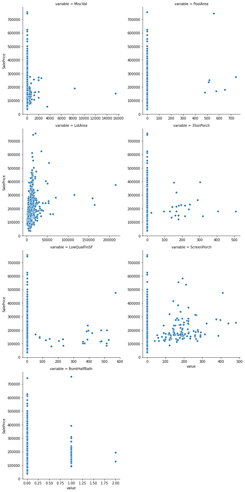


From the visualization, we can see that PoolArea, MiscVal, 3SsnPorch, LowQualSF has high number of zero value. In addition, they do not show any linearity or pattern of trend over SalePrice.

Thus, I decide to eliminate them from my model


```python
train_data.drop(['PoolArea','MiscVal', '3SsnPorch', 'LowQualFinSF'],axis=1,inplace=True)
test_data.drop(['PoolArea','MiscVal', '3SsnPorch', 'LowQualFinSF'],axis=1,inplace=True)
```


```python
quantitative_train=[f for f in train_data.columns if f in quantitative]
quantitative_df=pd.DataFrame()
for i in quantitative_train:
    quantitative_df[i]=train_data[i]
quantitative_df.skew(axis=0).sort_values(ascending=False)

```


    LotArea          12.207688
    BsmtFinSF2        4.255261
    ScreenPorch       4.122214
    BsmtHalfBath      4.103403
    EnclosedPorch     3.089872
    MasVnrArea        2.677616
    OpenPorchSF       2.364342
    SalePrice         1.882876
    BsmtFinSF1        1.685503
    WoodDeckSF        1.541376
    TotalBsmtSF       1.524255
    1stFlrSF          1.376757
    GrLivArea         1.366560
    BsmtUnfSF         0.920268
    2ndFlrSF          0.813030
    OverallCond       0.693067
    Fireplaces        0.649565
    BsmtFullBath      0.596067
    OverallQual       0.216944
    MoSold            0.212053
    FullBath          0.036562
    dtype: float64


```python
to_skew=['LotArea','BsmtFinSF2','ScreenPorch','EnclosedPorch','OpenPorchSF','BsmtFinSF1','WoodDeckSF','TotalBsmtSF','1stFlrSF','GrLivArea','BsmtUnfSF','2ndFlrSF','Fireplaces','BsmtFullBath']
```


```python
for i in to_skew:
    train_data[i]=np.log1p(train_data[i])
    test_data[i]=np.log1p(test_data[i])
    
```


```python
total=train_data.isnull().sum()
percent=total/(train_data.isnull().count())
missing_df=pd.concat([total,percent],axis=1,keys=["Value","Percent"]).sort_values(by='Percent',ascending=False)
missing_df.loc[missing_df['Value']>0]
```


<div>
<style scoped>
    .dataframe tbody tr th:only-of-type {
        vertical-align: middle;
    }

    .dataframe tbody tr th {
        vertical-align: top;
    }

    .dataframe thead th {
        text-align: right;
    }
</style>
<table border="1" class="dataframe">
  <thead>
    <tr style="text-align: right;">
      <th></th>
      <th>Value</th>
      <th>Percent</th>
    </tr>
  </thead>
  <tbody>
  </tbody>
</table>
</div>


```python
total=test_data.isnull().sum()
percent=total/(test_data.isnull().count())
missing_df=pd.concat([total,percent],axis=1,keys=["Value","Percent"]).sort_values(by='Percent',ascending=False)
missing_df.loc[missing_df['Value']>0]
```


<div>
<style scoped>
    .dataframe tbody tr th:only-of-type {
        vertical-align: middle;
    }

    .dataframe tbody tr th {
        vertical-align: top;
    }

    .dataframe thead th {
        text-align: right;
    }
</style>
<table border="1" class="dataframe">
  <thead>
    <tr style="text-align: right;">
      <th></th>
      <th>Value</th>
      <th>Percent</th>
    </tr>
  </thead>
  <tbody>
    <tr>
      <th>MSSubClass_Encode</th>
      <td>1</td>
      <td>0.000685</td>
    </tr>
  </tbody>
</table>
</div>


We can realize that there is a null value in MSSubClass_Encode. It is because that there is a value that only appears in test dataset but does not exist in train dataset.


```python
t=test['MSSubClass'].unique()
tr=train['MSSubClass'].unique()
```


```python
t=[f for f in t if f not in tr]
t
```


    [150]


We will need to fill this instance with mode


```python
test_data['MSSubClass_Encode']=test_data['MSSubClass_Encode'].fillna(test_data['MSSubClass_Encode'].mode()[0])
```

I think our data is now good enough for running models

# Modelling 


```python
from sklearn.model_selection import cross_val_score
from sklearn.metrics import make_scorer,mean_squared_error
```


```python
#create log-transformation for target variable
y=np.log1p(train_data['SalePrice'])
```


```python
x=train_data.drop(['SalePrice'],axis=1)
```

Before running various models to predict sales price, I will also create a function to evaluate the performance of model using kfold cross-validation

## 1. Linear Regression <a class="anchor" id="linear"></a>


```python
model=list()
eval_mean=list() #store mean value of RMSE on hold-out set
eval_std=list() #store standard deviation of RMSE on hold-out set
```


```python
from sklearn import linear_model
```


```python
lr=linear_model.LinearRegression()
cv = KFold(n_splits=5, random_state=1, shuffle=True)
scorer=make_scorer(mean_squared_error,greater_is_better=False)
rmse_train=np.sqrt(-cross_val_score(lr,x,y,scoring=scorer,cv=cv))

rmse_mean=rmse_train.mean()
rmse_sd=rmse_train.std()

model.append("Linear Regression")
eval_mean.append(rmse_mean)
eval_std.append(rmse_sd)

print("Average RMSE: {}".format(rmse_mean))
print("RMSE: {}".format(rmse_train))
```

    Average RMSE: 0.1276446717803346
    RMSE: [0.12708316 0.1524869  0.11385672 0.13908676 0.10570983]
    

We may also fit on the whole training set and see the performance of this model


```python
lr_model=lr.fit(x,y)
```


```python
y_train_pred=lr_model.predict(x)
```


```python
rmse_train2=np.sqrt(mean_squared_error(y,y_train_pred))
```


```python
y_pred=lr_model.predict(X_test)
rmse_test2=np.sqrt(mean_squared_error(Y_test,y_pred))
```


```python
print("RMSE of training set is: {}".format(rmse_train2))
print("RMSE of test set is: {}".format(rmse_test2))
```

    RMSE of training set is: 0.12051854300710749
    RMSE of test set is: 0.12477547718650846
    


```python
R2_train2=lr.score(X_train,Y_train)
R2_train2
```


    0.9128662778288621


```python
R2_test2=lr.score(X_test,Y_test)
R2_test2
```


    0.8992363549497138


Let's now plot the residual


```python
plt.figure(figsize=(10,8))
plt.scatter(y_train_pred,y_train_pred-y,color='lightgreen',marker='s',label='Training Set')
#plt.scatter(y_pred,y_pred-Y_test,color='blue',marker='s',label='Validation Set')
plt.xlabel('Predicted Value')
plt.ylabel('Residuals')
plt.hlines(y=0,xmin=10.5,xmax=13.5,color='red')
plt.legend(loc = "upper left")
```


    <matplotlib.legend.Legend at 0x1eec63b7a48>


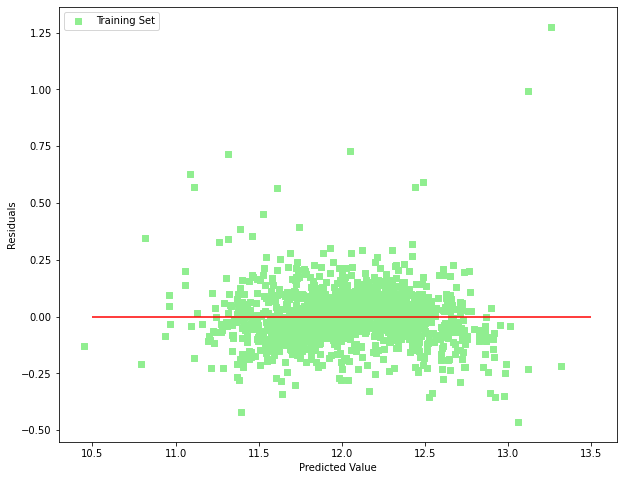


## 2. Lasso Regression <a class="anchor" id="lasso"></a>

https://scikit-learn.org/stable/modules/generated/sklearn.linear_model.LassoCV.html


```python
from sklearn.linear_model import LassoCV
from sklearn.linear_model import Lasso
```

A key parameter in Lasso regression is the regularized parameter. We can use Lasso Cross Validation to choose the optimal value


```python
lasso=LassoCV(alphas=[0.0001,0.001,0.002,0.003,0.006,0.1,0.15,1,10],cv=5,max_iter=5000)
lasso_model=lasso.fit(x,y)
```


```python
lasso_best_alpha=lasso_model.alpha_ #the best alpha
lasso_best_alpha
```


    0.001


```python
lasso_model=Lasso(alpha=lasso_best_alpha,max_iter=5000)

cv = KFold(n_splits=5, random_state=1, shuffle=True)
scorer=make_scorer(mean_squared_error,greater_is_better=False)
rmse_train=np.sqrt(-cross_val_score(lasso_model,x,y,scoring=scorer,cv=cv))

rmse_mean=rmse_train.mean()
rmse_sd=rmse_train.std()


print("Average RMSE: {}".format(rmse_mean))
print("RMSE: {}".format(rmse_train))
```

    Average RMSE: 0.1266290178868506
    RMSE: [0.12670799 0.15385419 0.11276227 0.13652835 0.10329229]
    


```python
model.append("Lasso Regression")

eval_mean.append(rmse_mean)
eval_std.append(rmse_sd)
```


```python
#we can also use Lasso to determine the coefficients impact
lasso_model=Lasso(alpha=lasso_best_alpha,max_iter=5000).fit(x,y)
```


```python
coeff=pd.DataFrame(data=lasso_model.coef_,columns=['Coefficient'],index=X_train.columns)
```


```python
coeff.loc[coeff['Coefficient']==0]
```


<div>
<style scoped>
    .dataframe tbody tr th:only-of-type {
        vertical-align: middle;
    }

    .dataframe tbody tr th {
        vertical-align: top;
    }

    .dataframe thead th {
        text-align: right;
    }
</style>
<table border="1" class="dataframe">
  <thead>
    <tr style="text-align: right;">
      <th></th>
      <th>Coefficient</th>
    </tr>
  </thead>
  <tbody>
    <tr>
      <th>LandSlope</th>
      <td>0.0</td>
    </tr>
    <tr>
      <th>ExterCond</th>
      <td>-0.0</td>
    </tr>
    <tr>
      <th>BsmtCond</th>
      <td>0.0</td>
    </tr>
    <tr>
      <th>BsmtFinType1</th>
      <td>0.0</td>
    </tr>
    <tr>
      <th>BsmtFinType2</th>
      <td>0.0</td>
    </tr>
    <tr>
      <th>BsmtHalfBath</th>
      <td>-0.0</td>
    </tr>
    <tr>
      <th>GarageFinish</th>
      <td>0.0</td>
    </tr>
    <tr>
      <th>OneKitchen</th>
      <td>0.0</td>
    </tr>
    <tr>
      <th>BelowFiveBedroom</th>
      <td>0.0</td>
    </tr>
    <tr>
      <th>Street_Encode</th>
      <td>0.0</td>
    </tr>
    <tr>
      <th>LotShape_Encode</th>
      <td>-0.0</td>
    </tr>
    <tr>
      <th>Heating_Encode</th>
      <td>0.0</td>
    </tr>
    <tr>
      <th>Electrical_Encode</th>
      <td>-0.0</td>
    </tr>
  </tbody>
</table>
</div>


```python
coeff=coeff.sort_values(by='Coefficient')
coefficient=coeff['Coefficient'].loc[coeff['Coefficient'] !=0]
important_features=coeff.loc[coeff['Coefficient'] !=0].index
plt.figure(figsize=(10,20))

sns.barplot(x=coefficient,y=important_features)
```


    <AxesSubplot:xlabel='Coefficient'>


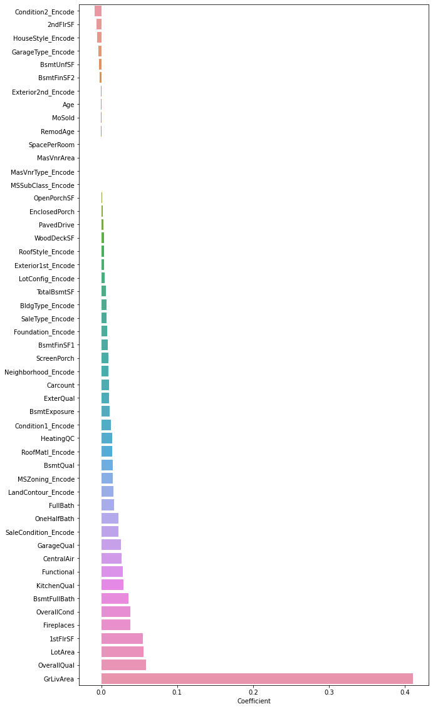


Just like when we do the EDA, the most important features to sales price are mostly related to space of the houses. People also seems to care more about the area in first floor, rather than in 2nd floor.

Such characteristics as the location and surronding neighborhood do not show significant impact to the houses value.


```python
drop_feature=coeff.loc[coeff['Coefficient']==0].index
drop_feature
```


    Index(['BelowFiveBedroom', 'GarageFinish', 'BsmtHalfBath', 'OneKitchen',
           'Heating_Encode', 'BsmtFinType2', 'BsmtFinType1', 'Street_Encode',
           'BsmtCond', 'LotShape_Encode', 'ExterCond', 'LandSlope',
           'Electrical_Encode'],
          dtype='object')


```python
x_revised=x.drop(drop_feature,axis=1)
```


```python
lasso=LassoCV(alphas=[0.0001,0.001,0.002,0.003,0.006,0.1,0.15,1,10],cv=5,max_iter=5000)
lasso_model=lasso.fit(x_revised,y)
lasso_best_alpha=lasso_model.alpha_ #the best alpha
lasso_best_alpha
```


    0.0001


```python
lasso_model=Lasso(alpha=lasso_best_alpha,max_iter=5000)

cv = KFold(n_splits=5, random_state=1, shuffle=True)
scorer=make_scorer(mean_squared_error,greater_is_better=False)
rmse_train=np.sqrt(-cross_val_score(lasso_model,x_revised,y,scoring=scorer,cv=cv))

rmse_mean=rmse_train.mean()
rmse_sd=rmse_train.std()


print("Average RMSE: {}".format(rmse_mean))
print("RMSE: {}".format(rmse_train))
```

    Average RMSE: 0.12635904521211355
    RMSE: [0.12583754 0.15247877 0.11329497 0.13650156 0.10368238]
    

It is apparent that the RMSE has been improved by dropping non-essential variables


```python
model.append("Lasso Regression Revised")

eval_mean.append(rmse_mean)
eval_std.append(rmse_sd)
```


```python
model
```


    ['Linear Regression', 'Lasso Regression', 'Lasso Regression Revised']


## 3. Ridge Regression <a class="anchor" id="ridge"></a>


```python
from sklearn.linear_model import RidgeCV
from sklearn.linear_model import Ridge
```


```python
ridge=RidgeCV(alphas=[0.01,0.05,0.1,0.2,0.3,0.4,0.5,0.5],cv=5)
ridge_model=ridge.fit(x,y)
```


```python
best_alpha=ridge_model.alpha_
best_alpha
```


    0.5


```python
ridge_model=Ridge(alpha=best_alpha)
```


```python
cv = KFold(n_splits=5, random_state=1, shuffle=True)
scorer=make_scorer(mean_squared_error,greater_is_better=False)
rmse_train=np.sqrt(-cross_val_score(ridge_model,x,y,scoring=scorer,cv=cv))

rmse_mean=rmse_train.mean()
rmse_sd=rmse_train.std()


print("Average RMSE: {}".format(rmse_mean))
print("RMSE: {}".format(rmse_train))
```

    Average RMSE: 0.12750729457764637
    RMSE: [0.12696925 0.15272111 0.11354434 0.13885302 0.10544875]
    


```python
model.append("Ridge Regression")

eval_mean.append(rmse_mean)
eval_std.append(rmse_sd)
```

## 4. Elastic Net <a class="anchor" id="elastic"></a>

Elastic Net is another regression model that can combine benefits of both Ridge Regression and Lasso Regression.

What we need to do at first is to tune the hyperameter of alpha and l1_ratio

- **l1_ratio (sometimes called as alpha)**: ratio of L1 penalities, which indicates how much weight you want to put all lasso regression.
- **alpha (usually called as lambda)**: controls the weighting of the sum of both penalties to the loss function. A default value of 1.0 is used to use the fully weighted penalty; a value of 0 excludes the penalty. Very small values of lambada, such as 1e-3 or smaller, are common.

elastic_net_penalty = (alpha * l1_penalty) + ((1 – alpha) * l2_penalty)

elastic_net_loss = loss + (lambda * elastic_net_penalty)


```python
from sklearn.linear_model import ElasticNet
from sklearn.model_selection import RepeatedKFold
from sklearn.model_selection import GridSearchCV


# define model
Elasticmodel = ElasticNet()
# define model evaluation method
cv = KFold(n_splits=5, random_state=1, shuffle=True)
# define grid
grid = dict()
grid['alpha'] = [1e-5, 1e-4, 1e-3, 1e-2, 1e-1, 0.0, 1.0, 10.0, 100.0]
grid['l1_ratio'] = np.arange(0, 1, 0.01)
# define search
search = GridSearchCV(Elasticmodel, grid, scoring=scorer, cv=cv, n_jobs=-1)
# perform the search
results = search.fit(x, y)
```


```python
print('Config: %s' % results.best_params_)
```

    Config: {'alpha': 0.001, 'l1_ratio': 0.7000000000000001}
    


```python
elastic_model = ElasticNet(alpha=results.best_params_['alpha'],l1_ratio=results.best_params_['l1_ratio'])
cv = KFold(n_splits=5, random_state=1, shuffle=True)
scorer=make_scorer(mean_squared_error,greater_is_better=False)
rmse_train=np.sqrt(-cross_val_score(elastic_model,x,y,scoring=scorer,cv=cv))

rmse_mean=rmse_train.mean()
rmse_sd=rmse_train.std()


print("Average RMSE: {}".format(rmse_mean))
print("RMSE: {}".format(rmse_train))
```

    Average RMSE: 0.12654572741119735
    RMSE: [0.12657918 0.15341793 0.11269764 0.13650202 0.10353186]
    

Let's fit on the simplied X set


```python
elastic_model = ElasticNet(alpha=results.best_params_['alpha'],l1_ratio=results.best_params_['l1_ratio'])
cv = KFold(n_splits=5, random_state=1, shuffle=True)
scorer=make_scorer(mean_squared_error,greater_is_better=False)
rmse_train=np.sqrt(-cross_val_score(elastic_model,x_revised,y,scoring=scorer,cv=cv))

rmse_mean=rmse_train.mean()
rmse_sd=rmse_train.std()


print("Average RMSE: {}".format(rmse_mean))
print("RMSE: {}".format(rmse_train))
```

    Average RMSE: 0.12635417332315582
    RMSE: [0.12609105 0.15340235 0.11264698 0.13648584 0.10314465]
    

Average RMSE has been improved a bit.


```python
model.append("ElasticNet Regression")

eval_mean.append(rmse_mean)
eval_std.append(rmse_sd)
```

## 5. Random Forest Regressor <a class="anchor" id="randomforest"></a>


```python
from sklearn.ensemble import RandomForestRegressor
```


```python
from sklearn.model_selection import GridSearchCV

RD_model=RandomForestRegressor()
grid_values={'n_estimators':[50,60,70,100,120,150],'max_depth':[4,5,6,7,8,9,10,15,20]}
grid_clf_acc = GridSearchCV(RD_model, param_grid = grid_values,scoring=scorer)
grid_clf_acc.fit(x, y)

print('Grid best parameter (max. accuracy): ', grid_clf_acc.best_params_)
```

    Grid best parameter (max. accuracy):  {'max_depth': 15, 'n_estimators': 70}
    


```python
RD=RandomForestRegressor(n_estimators=grid_clf_acc.best_params_['n_estimators'],max_depth=grid_clf_acc.best_params_['max_depth'])

cv = KFold(n_splits=5, random_state=1, shuffle=True)
scorer=make_scorer(mean_squared_error,greater_is_better=False)
rmse_train=np.sqrt(-cross_val_score(RD,x,y,scoring=scorer,cv=cv))

rmse_mean=rmse_train.mean()
rmse_sd=rmse_train.std()


print("Average RMSE: {}".format(rmse_mean))
print("RMSE: {}".format(rmse_train))
```

    Average RMSE: 0.14124217877373169
    RMSE: [0.14193348 0.16447365 0.14225304 0.13826501 0.11928572]
    

## 6. XGBoost Regressor <a class="anchor" id="xgboost"></a>

XGBoost is obviously the most widely-used algorithm in data science competitions.

The most difficult part of XGBoost is how to find the optimal parameters for model fitting. To assist this task, I will use GridSearch CV and sequentially optimize each common parameters


```python
def RMSE(model,x,y,nfold):
    import random
    random.seed(123)
    from sklearn.model_selection import KFold
    cv = KFold(n_splits=nfold, random_state=1, shuffle=True)
    scorer=make_scorer(mean_squared_error,greater_is_better=False)
    rmse_train=np.sqrt(-cross_val_score(model,x,y,scoring=scorer,cv=cv))

    print("Average RMSE: {}".format(rmse_train.mean()))
    print("RMSE: {}".format(rmse_train))
```


```python
!pip install xgboost
import xgboost as xgb
```

    Requirement already satisfied: xgboost in d:\program files\data science\anaconda\lib\site-packages (1.1.1)
    Requirement already satisfied: numpy in d:\program files\data science\anaconda\lib\site-packages (from xgboost) (1.18.4)
    Requirement already satisfied: scipy in d:\program files\data science\anaconda\lib\site-packages (from xgboost) (1.4.1)
    

To create a baseline model, I will simply fit a XGBRegressor with some initial parameters


```python
xgb_tune = xgb.XGBRegressor(
 learning_rate =0.1,
 n_estimators=1000,
 max_depth=5,
 min_child_weight=1,
 gamma=0,alpha=0,
 subsample=0.8,
 colsample_bytree=0.8,
 objective= 'reg:squarederror',
 scale_pos_weight=0,
 seed=123)

RMSE(xgb_tune,x,y,5)
```

    Average RMSE: 0.12299591041395627
    RMSE: [0.12612758 0.13820491 0.11950635 0.1304574  0.10068331]
    

It is interesting that though we have not fine tuned any, the outcome is already much better than other previous models.

The first step is to fine tune 'n_estimators': The number of sequential trees to be modeled 


```python
xgb_tune = xgb.XGBRegressor(
 learning_rate =0.01,
  max_depth=5,
 min_child_weight=1,
 gamma=0,alpha=0,
 subsample=0.8,
 colsample_bytree=0.8,
 objective= 'reg:squarederror',
 scale_pos_weight=1,
 seed=123)


scorer=make_scorer(mean_squared_error,greater_is_better=False)
grid_values={'n_estimators':range(100,2000,100)}
cv = KFold(n_splits=5, random_state=1, shuffle=True)
grid_clf_acc = GridSearchCV(xgb_tune, param_grid = grid_values,scoring=scorer,cv=cv)
grid_clf_acc.fit(x,y)

grid_clf_acc.best_params_,np.sqrt(-grid_clf_acc.best_score_)
```


    ({'n_estimators': 1900}, 0.12022611271517354)


Next, we will find the value of.

- max_depth

- min_child_weight:the minimum sum of weights of all observations required in a child.

We will also fix our n_estimators to 1900


```python
xgb_tune = xgb.XGBRegressor(
 learning_rate =0.01,
 n_estimators=1900,
 max_depth=5, min_child_weight=1,
 gamma=0,alpha=0,
 subsample=0.8,
 colsample_bytree=0.8,
 objective= 'reg:squarederror',
 scale_pos_weight=1,
 seed=123)


scorer=make_scorer(mean_squared_error,greater_is_better=False)
grid_values={'max_depth':range(4,10,1),'min_child_weight':range(1,6,1)}
cv = KFold(n_splits=5, random_state=1, shuffle=True)
grid_clf_acc = GridSearchCV(xgb_tune, param_grid = grid_values,scoring=scorer,cv=cv)
grid_clf_acc.fit(x,y)

grid_clf_acc.best_params_,np.sqrt(-grid_clf_acc.best_score_)
```


    ({'max_depth': 4, 'min_child_weight': 2}, 0.11824793699184784)


Fine tune **gamma**:

A node is split only when the resulting split gives a positive reduction in the loss function. Gamma specifies the minimum loss reduction required to make a split.


```python
xgb_tune = xgb.XGBRegressor(
 learning_rate =0.01,
 n_estimators=1900,
 max_depth=4, min_child_weight=2,
 gamma=0,alpha=0,
 subsample=0.8,
 colsample_bytree=0.8,
 objective= 'reg:squarederror',
 scale_pos_weight=1,
 seed=123)

scorer=make_scorer(mean_squared_error,greater_is_better=False)
grid_values={'gamma':[i/10 for i in range(0,6,1)]}
cv = KFold(n_splits=5, random_state=1, shuffle=True)

grid_clf_acc = GridSearchCV(xgb_tune, param_grid = grid_values,scoring=scorer,cv=cv)
grid_clf_acc.fit(x,y)

grid_clf_acc.best_params_,np.sqrt(-grid_clf_acc.best_score_)
```


    ({'gamma': 0.0}, 0.11824793699184784)


Fine tune **subsample** and **colsample_bytree**


```python
xgb_tune = xgb.XGBRegressor(
 learning_rate =0.01,
 n_estimators=1900,
 max_depth=4, min_child_weight=2,
 gamma=0,alpha=0,
 subsample=0.8,
 colsample_bytree=0.8,
 objective= 'reg:squarederror',
 scale_pos_weight=1,
 seed=123)

scorer=make_scorer(mean_squared_error,greater_is_better=False)
grid_values={'subsample':[0.5,0.6,0.7,0.8,0.9],'colsample_bytree':[0.5,0.6,0.7,0.8,0.9]}
cv = KFold(n_splits=5, random_state=1, shuffle=True)

grid_clf_acc = GridSearchCV(xgb_tune, param_grid = grid_values,scoring=scorer,cv=cv)
grid_clf_acc.fit(x,y)

grid_clf_acc.best_params_,np.sqrt(-grid_clf_acc.best_score_)
```


    ({'colsample_bytree': 0.9, 'subsample': 0.5}, 0.11692468460224818)


The final hyper-parameter that I will fine tune is "alpha": L1 regularization term on weight (analogous to Lasso regression)


```python
xgb_tune = xgb.XGBRegressor(
 learning_rate =0.01,
 n_estimators=1900,
 max_depth=4, min_child_weight=2,
 gamma=0,alpha=0,
 subsample=0.5,
 colsample_bytree=0.9,
 objective= 'reg:squarederror',
 scale_pos_weight=1,
 seed=123)

scorer=make_scorer(mean_squared_error,greater_is_better=False)
grid_values={'alpha':[0.01,0.05,0.1,0.5,1,10,50,100]}
cv = KFold(n_splits=5, random_state=1, shuffle=True)

grid_clf_acc = GridSearchCV(xgb_tune, param_grid = grid_values,scoring=scorer,cv=cv)
grid_clf_acc.fit(x,y)

grid_clf_acc.best_params_,np.sqrt(-grid_clf_acc.best_score_)
```


    ({'alpha': 0.01}, 0.11696721813267275)


```python
xgb_tune = xgb.XGBRegressor(
 learning_rate =0.01,
 n_estimators=1900,
 max_depth=4, min_child_weight=2,
 gamma=0,alpha=0.01,
 subsample=0.5,
 colsample_bytree=0.9,
 objective= 'reg:squarederror',
 scale_pos_weight=1,
 seed=123)

cv = KFold(n_splits=5, random_state=1, shuffle=True)
scorer=make_scorer(mean_squared_error,greater_is_better=False)
rmse_train=np.sqrt(-cross_val_score(xgb_tune,x,y,scoring=scorer,cv=cv))

rmse_mean=rmse_train.mean()
rmse_sd=rmse_train.std()


print("Average RMSE: {}".format(rmse_mean))
print("RMSE: {}".format(rmse_train))


```

    Average RMSE: 0.11650322715255963
    RMSE: [0.12027498 0.1308675  0.11135498 0.12026207 0.09975661]
    


```python
model.append("XGBoost")

eval_mean.append(rmse_mean)
eval_std.append(rmse_sd)
```

## 7. Stacking Model <a class="stacking" id="xgboost"></a>

I will run stacking model also to see if the prediction accuracy can be greatly improved 


```python
from sklearn.ensemble import StackingRegressor

level0 = list()
level0.append(('ridge',ridge_model))
level0.append(('linea',lr))
level0.append(('ElasticNet', elastic_model))
#level0.append(('RandomForest', RandomForestRegressor(n_estimators=60,max_depth=15)))
level0.append(('XGboost',xgb_tune))
level0.append(('LassoRegression', lasso_model))

# define meta learner model
level1 = elastic_model
# define the stacking ensemble
stack_model = StackingRegressor(estimators=level0, final_estimator=level1, cv=5,passthrough=True)
# fit the model on all available data
#stack_model=stack_model.fit(x, y)
```


```python
cv = KFold(n_splits=5, random_state=1, shuffle=True)
scorer=make_scorer(mean_squared_error,greater_is_better=False)
rmse_train=np.sqrt(-cross_val_score(stack_model,x,y,scoring=scorer,cv=cv))

rmse_mean=rmse_train.mean()
rmse_sd=rmse_train.std()


print("Average RMSE: {}".format(rmse_mean))
print("RMSE: {}".format(rmse_train))
```

    Average RMSE: 0.11687265270776195
    RMSE: [0.11917077 0.13860908 0.10557165 0.12456782 0.09644394]
    


```python
model.append("Stacking")

eval_mean.append(rmse_mean)
eval_std.append(rmse_sd)
```


```python
result_table=pd.DataFrame(zip(model,eval_mean,eval_std),columns=['Model','Mean','Std'])
result_table
```


<div>
<style scoped>
    .dataframe tbody tr th:only-of-type {
        vertical-align: middle;
    }

    .dataframe tbody tr th {
        vertical-align: top;
    }

    .dataframe thead th {
        text-align: right;
    }
</style>
<table border="1" class="dataframe">
  <thead>
    <tr style="text-align: right;">
      <th></th>
      <th>Model</th>
      <th>Mean</th>
      <th>Std</th>
    </tr>
  </thead>
  <tbody>
    <tr>
      <th>0</th>
      <td>Linear Regression</td>
      <td>0.127645</td>
      <td>0.016850</td>
    </tr>
    <tr>
      <th>1</th>
      <td>Lasso Regression</td>
      <td>0.126629</td>
      <td>0.017754</td>
    </tr>
    <tr>
      <th>2</th>
      <td>Lasso Regression Revised</td>
      <td>0.126359</td>
      <td>0.017148</td>
    </tr>
    <tr>
      <th>3</th>
      <td>Ridge Regression</td>
      <td>0.127507</td>
      <td>0.017008</td>
    </tr>
    <tr>
      <th>4</th>
      <td>ElasticNet Regression</td>
      <td>0.126354</td>
      <td>0.017669</td>
    </tr>
    <tr>
      <th>5</th>
      <td>XGBoost</td>
      <td>0.116503</td>
      <td>0.010408</td>
    </tr>
    <tr>
      <th>6</th>
      <td>Stacking</td>
      <td>0.116873</td>
      <td>0.014711</td>
    </tr>
  </tbody>
</table>
</div>


Based on Cross-Validation, we can easily that XGBoost is the best model, with lowest mean and variance of RMSE

# Submission


```python
submission=pd.DataFrame()
```


```python
submission['Id']=test.Id
```


```python
xgb_tune = xgb.XGBRegressor(
 learning_rate =0.01,
 n_estimators=1900,
 max_depth=4, min_child_weight=2,
 gamma=0,alpha=0.01,
 subsample=0.5,
 colsample_bytree=0.9,
 objective= 'reg:squarederror',
 scale_pos_weight=1,
 seed=123).fit(x,y)
```


```python
test_pred=np.expm1(xgb_tune.predict(test_data))
```


```python
submission['SalePrice']=test_pred
```


```python
submission.info()
```

    <class 'pandas.core.frame.DataFrame'>
    RangeIndex: 1459 entries, 0 to 1458
    Data columns (total 2 columns):
     #   Column     Non-Null Count  Dtype  
    ---  ------     --------------  -----  
     0   Id         1459 non-null   int64  
     1   SalePrice  1459 non-null   float32
    dtypes: float32(1), int64(1)
    memory usage: 17.2 KB
    


```python
submission
```


<div>
<style scoped>
    .dataframe tbody tr th:only-of-type {
        vertical-align: middle;
    }

    .dataframe tbody tr th {
        vertical-align: top;
    }

    .dataframe thead th {
        text-align: right;
    }
</style>
<table border="1" class="dataframe">
  <thead>
    <tr style="text-align: right;">
      <th></th>
      <th>Id</th>
      <th>SalePrice</th>
    </tr>
  </thead>
  <tbody>
    <tr>
      <th>0</th>
      <td>1461</td>
      <td>121896.593750</td>
    </tr>
    <tr>
      <th>1</th>
      <td>1462</td>
      <td>164148.906250</td>
    </tr>
    <tr>
      <th>2</th>
      <td>1463</td>
      <td>180666.046875</td>
    </tr>
    <tr>
      <th>3</th>
      <td>1464</td>
      <td>191166.062500</td>
    </tr>
    <tr>
      <th>4</th>
      <td>1465</td>
      <td>186090.031250</td>
    </tr>
    <tr>
      <th>...</th>
      <td>...</td>
      <td>...</td>
    </tr>
    <tr>
      <th>1454</th>
      <td>2915</td>
      <td>80513.085938</td>
    </tr>
    <tr>
      <th>1455</th>
      <td>2916</td>
      <td>77816.984375</td>
    </tr>
    <tr>
      <th>1456</th>
      <td>2917</td>
      <td>156430.406250</td>
    </tr>
    <tr>
      <th>1457</th>
      <td>2918</td>
      <td>115848.429688</td>
    </tr>
    <tr>
      <th>1458</th>
      <td>2919</td>
      <td>197363.234375</td>
    </tr>
  </tbody>
</table>
<p>1459 rows × 2 columns</p>
</div>


```python
submission.to_csv('submission_Khoi.csv', index=False)
```


```python

```
